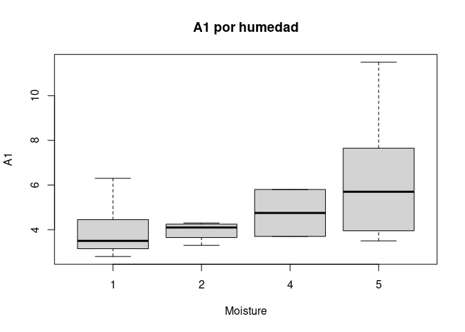
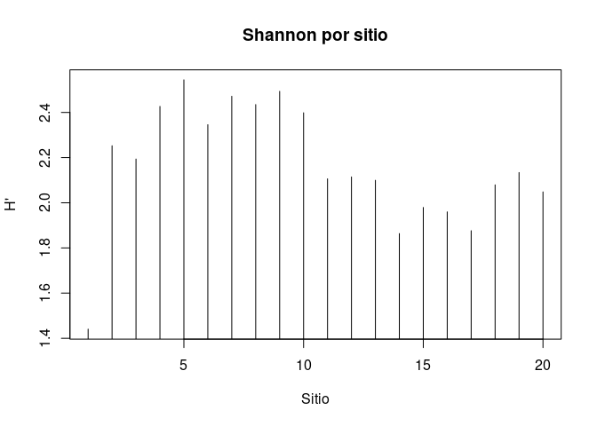
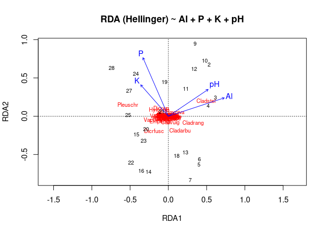
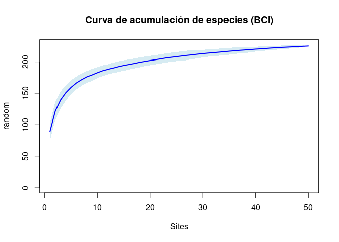
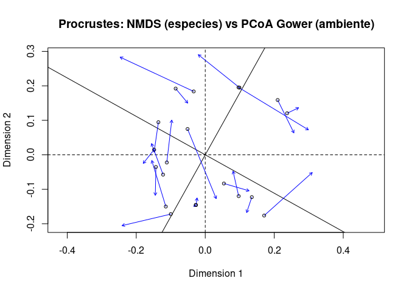
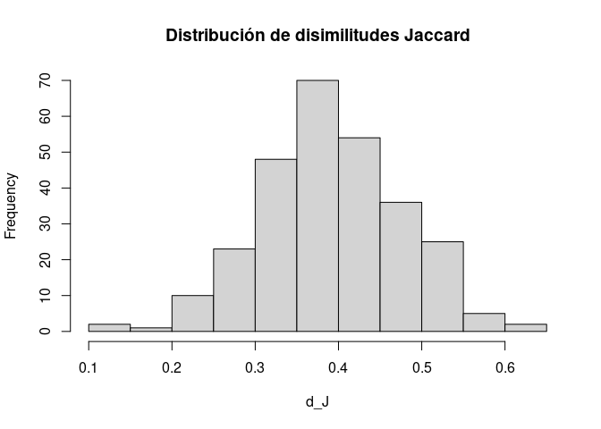

Técnicas de ecología numérica con *datasets* de R
================
Biogeografía (GEO-131)
2025-08-30

- [Fecha/hora de entrega](#fechahora-de-entrega)
- [Introducción](#introducción)
- [Objetivos](#objetivos)
- [Cómo usar estos ejercicios](#cómo-usar-estos-ejercicios)
- [Ejercicio 01 · EDA + diversidad + clúster
  (dune)](#ejercicio-01--eda--diversidad--clúster-dune)
- [Ejercicio 02 · Modos Q/R y paradoja de
  Orlóci](#ejercicio-02--modos-qr-y-paradoja-de-orlóci)
- [Ejercicio 03 · NMDS + envfit
  (dune)](#ejercicio-03--nmds--envfit-dune)
- [Ejercicio 04 · PCA vs CA
  (varechem/varespec)](#ejercicio-04--pca-vs-ca-varechemvarespec)
- [Ejercicio 05 · RDA (Hellinger) y varianza
  explicada](#ejercicio-05--rda-hellinger-y-varianza-explicada)
- [Ejercicio 06 · Partición de varianza ambiente vs espacio
  (mite)](#ejercicio-06--partición-de-varianza-ambiente-vs-espacio-mite)
- [Ejercicio 07 · PERMANOVA + betadisper
  (dune)](#ejercicio-07--permanova--betadisper-dune)
- [Ejercicio 08 · Especies
  indicadoras](#ejercicio-08--especies-indicadoras)
- [Ejercicio 09 · Acumulación y rarefacción
  (BCI)](#ejercicio-09--acumulación-y-rarefacción-bci)
- [Ejercicio 10 · Procrustes: comparar
  ordenaciones](#ejercicio-10--procrustes-comparar-ordenaciones)
- [Ejercicio 11 · Elegir k con
  silhouette](#ejercicio-11--elegir-k-con-silhouette)
- [Ejercicio 12 · CCA (varespec ~
  varechem)](#ejercicio-12--cca-varespec--varechem)
- [Ejercicio 13 · db-RDA / capscale (distancia no
  euclídea)](#ejercicio-13--db-rda--capscale-distancia-no-euclídea)
- [Ejercicio 14 · Tendencia espacial (polinomios) vs MEM/PCNM
  (opcional)](#ejercicio-14--tendencia-espacial-polinomios-vs-mempcnm-opcional)
- [Ejercicio 15 · Diversidad beta (índices y
  partición)](#ejercicio-15--diversidad-beta-índices-y-partición)
- [Ejercicio 16 · Diversidad alfa con estimadores de Chao (SpadeR,
  iNEXT)](#ejercicio-16--diversidad-alfa-con-estimadores-de-chao-spader-inext)
- [Ejercicio 17 · SDM (Modelos de Distribución de Especies) —
  *introducción
  compacta*](#ejercicio-17--sdm-modelos-de-distribución-de-especies--introducción-compacta)

Versión HTML (quizá más legible),
[aquí](https://biogeografia-master.github.io/tecnicas-ecologia-numerica-con-datasets-de-r/README.html)

# Fecha/hora de entrega

**Ver portal de la asignatura**

# Introducción

Este cuaderno reúne **17 ejercicios prácticos** para explorar, con datos
reales de R, un conjunto de **técnicas fundamentales de ecología
numérica y biogeografía**: desde el **análisis exploratorio de datos
(AED)** y las **medidas de diversidad** (alfa, beta), pasando por
**ordenaciones** (PCA, CA, NMDS, CCA, db-RDA), **agrupamientos** y
**pruebas permutacionales**, hasta **modelos de distribución de especies
(SDM)** y **estimadores modernos de riqueza** (Chao, iNEXT). El hilo
conductor es doble: (i) **formular preguntas ecológico-biogeográficas
claras** y (ii) **elegir y aplicar** la técnica apropiada con sus
**supuestos, limitaciones e interpretación**.

Todos los ejercicios usan *datasets* clásicos (p. ej., `dune`,
`varespec/varechem`, `BCI`, `mite`), lo que facilita contrastar
resultados con la literatura y con ayuda de IA (siempre **verificando**
contra la documentación del paquete; por ejemplo, consulta `?dune`).
Cada actividad termina con un **mandato de interpretación**,
**formulación de preguntas** y **reflexión** sobre **implicaciones
ecológicas, biogeográficas y, cuando proceda, de conservación**. Más que
“correr código”, el objetivo es **razonar**: qué mide cada índice, qué
representa cada eje, qué hipótesis subyacen a cada método, y cómo
influyen **transformaciones**, **distancias**, **diseño de muestreo** y
**escala espacial** en las conclusiones.

El cuaderno está diseñado para **ejecución reproducible** (semillas
fijadas, bloques autocontenidos) y para que puedas **elegir 1 de 17**
según tus intereses: comparar **modo Q vs. R**, estimar la **riqueza
esperada** con **Chao/iNEXT**, descomponer la **beta-diversidad** en
**recambio** y **anidamiento**, o construir un **SDM** introductorio con
regresión logística como alternativa ligera a MaxEnt/ML. En todos los
casos se prioriza la **interpretación crítica** por encima de la
longitud del código.

# Objetivos

1.  **Vincular preguntas ecológico-biogeográficas con herramientas
    cuantitativas**, eligiendo medidas de **distancia**,
    **transformaciones** y **técnicas** acordes a los datos y sus
    supuestos.

2.  **Aplicar e interpretar** técnicas de **ordenación** (PCA, CA, NMDS,
    CCA, db-RDA/capscale) y **agrupamiento** (UPGMA, Ward), incluyendo
    **verificación de supuestos** y lectura de **biplots** y
    **dendrogramas**.

3.  **Cuantificar diversidad** (alfa, beta) y **particionarla** para
    inferir **patrones de composición** y **heterogeneidad** entre
    sitios.

4.  **Estimar riqueza esperada** y **cobertura de muestreo** con
    **Chao/iNEXT**, interpretando **curvas de
    rarefacción/extrapolación** y diferencias entre `S_obs` y
    estimadores (`S_chao1`, `S_chao1_bc`, `S_ichao1`).

5.  **Probar hipótesis** sobre diferencias entre grupos o gradientes
    mediante **PERMANOVA**, **betadisper** y **pruebas
    permutacionales**, distinguiendo efectos de **centroides**
    vs. **dispersión**.

6.  **Analizar estructura espacial** (superficies de tendencia,
    **MEM/PCNM**) y **partición de varianza** ambiente–espacio,
    relacionando **procesos** (filtros ambientales, dispersión limitada)
    y **escalas**.

7.  **Construir un SDM introductorio** (GLM binomial) para generar
    **mapas de idoneidad**, discutir **evaluación** (p. ej., AUC/ROC),
    **umbrales** y **riesgos de extrapolación**.

8.  **Comunicar resultados**: para cada ejercicio, **interpretar
    salidas**, **formular al menos dos preguntas** que los resultados
    permitan abordar y **reflexionar** sobre **implicaciones
    ecológicas/biogeográficas** y, cuando proceda, **de conservación**.

# Cómo usar estos ejercicios

- Cada **ejercicio** está pensado para realizarse en **30 minutos**, con
  objetivos, dataset, pasos y preguntas. **¡¡Toma nota!!: elige DOS
  ejercicios y anúncialos en el foro**. **IMPORTANTE** Te desaconsejo
  elegir por longitud de código y texto, pues los ejercicios que tienen
  menos código, son normalmente los más complicados.

- Las secciones incluyen **código ejecutable** y **tareas** de
  interpretación. El código ejecutable, lógicamente, debe ejecutarse
  para comprobar que funciona, y para familiarizarse con la sintaxis.

- Debes investigar, por tu cuenta y con ayuda de IA, sobre lo siguiente:

  - **Los *datasets* usados, para entender su origen, muestreo, y
    variables medidas.** Esto es muy importante, porque si no comprendes
    los datos, muchas preguntas no podrás responderlas. Puedes preguntar
    a IAs sobre los *datasets*, pues la mayoría son conocidos; eso sí,
    no aceptes descripciones de la IA sin comprobarlas. Dado que todos
    los *datasets* usados en estos ejercicios vienen asociados a
    paquetes de R, también puedes ver sus correspondientes descripciones
    usando la consola; por ejemplo, para ver la descripción del
    *dataset* `dune`, basta con ejecutar `help(dune)` o `?dune` en la
    consola de R.
  - \*\*Discute limitaciones de los datasets y decisiones analíticas
    (transformaciones, distancias, métodos).
  - **Las técnicas empleadas en cada caso, para explicar qué responden,
    para qué sirven, y sus supuestos.** Investigando para qué sirve la
    técnica usada en tu ejercicio elegido, podrás detemrinar qué
    preguntas te ayuda a responder dicha técnica. Investigando sobre los
    supuestos, sabrás cuándo tus datos cumplen con las condiciones para
    usar una técnica u otra.

------------------------------------------------------------------------

# Ejercicio 01 · EDA + diversidad + clúster (dune)

**Objetivo.** Reforzar AED, diversidad alfa/beta y agrupamiento
jerárquico (UPGMA) con `dune` (comunidades de plantas) y `dune.env`
(ambiente).

**Dataset.**

``` r
library(vegan)
data(dune); data(dune.env)
dim(dune); dim(dune.env)
```

    #> [1] 20 30

    #> [1] 20  5

``` r
head(dune[,1:6]); head(dune.env)
```

    #>   Achimill Agrostol Airaprae Alopgeni Anthodor Bellpere
    #> 1        1        0        0        0        0        0
    #> 2        3        0        0        2        0        3
    #> 3        0        4        0        7        0        2
    #> 4        0        8        0        2        0        2
    #> 5        2        0        0        0        4        2
    #> 6        2        0        0        0        3        0

    #>    A1 Moisture Management      Use Manure
    #> 1 2.8        1         SF Haypastu      4
    #> 2 3.5        1         BF Haypastu      2
    #> 3 4.3        2         SF Haypastu      4
    #> 4 4.2        2         SF Haypastu      4
    #> 5 6.3        1         HF Hayfield      2
    #> 6 4.3        1         HF Haypastu      2

**Pasos.**

1.  **EDA** de variables ambientales:

``` r
summary(dune.env)
```

    #>        A1         Moisture Management       Use    Manure
    #>  Min.   : 2.800   1:7      BF:3       Hayfield:7   0:6   
    #>  1st Qu.: 3.500   2:4      HF:5       Haypastu:8   1:3   
    #>  Median : 4.200   4:2      NM:6       Pasture :5   2:4   
    #>  Mean   : 4.850   5:7      SF:6                    3:4   
    #>  3rd Qu.: 5.725                                    4:3   
    #>  Max.   :11.500

``` r
table(dune.env$Management)
```

    #> 
    #> BF HF NM SF 
    #>  3  5  6  6

``` r
boxplot(A1 ~ Moisture, data=dune.env, main="A1 por humedad")
```

<!-- -->

``` r
boxplot(A1 ~ Management, data=dune.env, main="A1 por Manejo")
```

<!-- -->

2.  **Diversidad alfa** (Shannon/Simpson) y **riqueza** por sitio:

``` r
div_sh <- diversity(dune, "shannon")
div_si <- diversity(dune, "simpson")
rich   <- specnumber(dune)
plot(div_sh, type="h", main="Shannon por sitio", xlab="Sitio", ylab="H'")
```

<!-- -->

3.  **Distancias Bray–Curtis** y **clúster UPGMA** (average):

``` r
d_bc <- vegdist(dune, method="bray")
clu  <- hclust(d_bc, method="average")
plot(clu, main="Dendrograma (Bray–Curtis + UPGMA)")
```

<!-- -->

**Mandato**

0.  **Preguntas guía para responder.** ¿Cuántos grupos cortarías? ¿Se
    asocian con `Management`, `Moisture` o `A1`?

1.  **Interpreta**: explica qué te dicen los grupos sobre la composición
    y cómo se relacionan (o no) con `Management`/`A1`.

2.  **Formula dos preguntas** que puedan responderse con estos
    resultados o con la técnica empleada (p. ej., ¿qué especies definen
    cada grupo?, ¿hay gradientes ambientales subyacentes?).

3.  **Reflexiona** sobre implicaciones **ecológicas/biogeográficas** y,
    si aplica, **de conservación** (p. ej., manejo diferenciado por
    grupos).

------------------------------------------------------------------------

# Ejercicio 02 · Modos Q/R y paradoja de Orlóci

**Objetivo.** Comparar **modo Q** (sitios) vs **modo R** (variables), y
mostrar cómo **transformaciones** y **medidas** cambian conclusiones
(paradoja de Orlóci).

``` r
data(varespec); data(varechem)
# Modo Q: distancias entre sitios con abundancias crudas vs Hellinger
d_raw <- vegdist(varespec, "bray")
sp_hel <- decostand(varespec, "hellinger")
d_hel <- dist(sp_hel)  # euclídea sobre Hellinger
par(mfrow=c(1,2)); plot(hclust(d_raw), main="Clúster (Bray, crudo)")
plot(hclust(d_hel), main="Clúster (Euclídea, Hellinger)"); par(mfrow=c(1,1))
```

<!-- -->

``` r
# Modo R: correlaciones entre variables ambientales
cor_mat <- cor(varechem)
round(cor_mat, 2)
```

    #>              N     P     K    Ca    Mg     S    Al    Fe    Mn    Zn    Mo
    #> N         1.00 -0.25 -0.15 -0.27 -0.16 -0.26 -0.04  0.17  0.08 -0.13 -0.06
    #> P        -0.25  1.00  0.75  0.74  0.60  0.75  0.05 -0.13  0.54  0.70  0.17
    #> K        -0.15  0.75  1.00  0.66  0.63  0.84  0.12 -0.09  0.54  0.60  0.07
    #> Ca       -0.27  0.74  0.66  1.00  0.80  0.54 -0.21 -0.33  0.44  0.68 -0.16
    #> Mg       -0.16  0.60  0.63  0.80  1.00  0.65 -0.12 -0.20  0.26  0.71  0.03
    #> S        -0.26  0.75  0.84  0.54  0.65  1.00  0.36  0.06  0.27  0.71  0.43
    #> Al       -0.04  0.05  0.12 -0.21 -0.12  0.36  1.00  0.82 -0.47 -0.06  0.51
    #> Fe        0.17 -0.13 -0.09 -0.33 -0.20  0.06  0.82  1.00 -0.44 -0.31  0.22
    #> Mn        0.08  0.54  0.54  0.44  0.26  0.27 -0.47 -0.44  1.00  0.36 -0.20
    #> Zn       -0.13  0.70  0.60  0.68  0.71  0.71 -0.06 -0.31  0.36  1.00  0.28
    #> Mo       -0.06  0.17  0.07 -0.16  0.03  0.43  0.51  0.22 -0.20  0.28  1.00
    #> Baresoil  0.11  0.01  0.17  0.18  0.24  0.08 -0.40 -0.46  0.25  0.04  0.03
    #> Humdepth  0.08  0.15  0.27  0.24  0.37  0.16 -0.49 -0.49  0.51  0.14  0.06
    #> pH       -0.04 -0.03 -0.23  0.09 -0.09 -0.19  0.42  0.44 -0.39 -0.09 -0.17
    #>          Baresoil Humdepth    pH
    #> N            0.11     0.08 -0.04
    #> P            0.01     0.15 -0.03
    #> K            0.17     0.27 -0.23
    #> Ca           0.18     0.24  0.09
    #> Mg           0.24     0.37 -0.09
    #> S            0.08     0.16 -0.19
    #> Al          -0.40    -0.49  0.42
    #> Fe          -0.46    -0.49  0.44
    #> Mn           0.25     0.51 -0.39
    #> Zn           0.04     0.14 -0.09
    #> Mo           0.03     0.06 -0.17
    #> Baresoil     1.00     0.59 -0.53
    #> Humdepth     0.59     1.00 -0.72
    #> pH          -0.53    -0.72  1.00

**Mandato**

0.  **Describe diferencias entre dendrogramas y justifica elección** de
    transformación/distancia.\*\*

1.  **Interpreta** las discrepancias entre modos Q/R y su causa.

2.  **Formula dos preguntas** que puedan responderse con estos
    resultados o con la técnica empleada (p. ej., ¿qué transformación
    estabiliza mejor la varianza?, ¿qué variables redundantes detecta el
    modo R?).

3.  **Reflexiona** sobre implicaciones para comparar sitios y para el
    diseño de muestreo/variables.

------------------------------------------------------------------------

# Ejercicio 03 · NMDS + envfit (dune)

**Objetivo.** Realizar **NMDS** (Bray) y ajustar vectores ambientales
(`envfit`).

``` r
set.seed(123)
m <- metaMDS(dune, distance="bray", k=2, trymax=50)
```

    #> Run 0 stress 0.1192678 
    #> Run 1 stress 0.1192679 
    #> ... Procrustes: rmse 0.0001940161  max resid 0.0005952259 
    #> ... Similar to previous best
    #> Run 2 stress 0.1889642 
    #> Run 3 stress 0.1183186 
    #> ... New best solution
    #> ... Procrustes: rmse 0.02027001  max resid 0.06496047 
    #> Run 4 stress 0.1183186 
    #> ... New best solution
    #> ... Procrustes: rmse 1.241809e-06  max resid 4.262694e-06 
    #> ... Similar to previous best
    #> Run 5 stress 0.1183186 
    #> ... Procrustes: rmse 4.17945e-06  max resid 1.118537e-05 
    #> ... Similar to previous best
    #> Run 6 stress 0.2252534 
    #> Run 7 stress 0.1183186 
    #> ... Procrustes: rmse 2.378251e-06  max resid 7.589195e-06 
    #> ... Similar to previous best
    #> Run 8 stress 0.1183186 
    #> ... Procrustes: rmse 2.196165e-06  max resid 5.819274e-06 
    #> ... Similar to previous best
    #> Run 9 stress 0.1183186 
    #> ... Procrustes: rmse 5.112688e-06  max resid 1.537429e-05 
    #> ... Similar to previous best
    #> Run 10 stress 0.1192679 
    #> Run 11 stress 0.1192678 
    #> Run 12 stress 0.1183186 
    #> ... Procrustes: rmse 3.656443e-06  max resid 1.29151e-05 
    #> ... Similar to previous best
    #> Run 13 stress 0.1809578 
    #> Run 14 stress 0.1183186 
    #> ... Procrustes: rmse 6.681814e-06  max resid 2.015328e-05 
    #> ... Similar to previous best
    #> Run 15 stress 0.1183186 
    #> ... Procrustes: rmse 1.051499e-05  max resid 3.430309e-05 
    #> ... Similar to previous best
    #> Run 16 stress 0.1183186 
    #> ... New best solution
    #> ... Procrustes: rmse 8.560065e-07  max resid 2.056924e-06 
    #> ... Similar to previous best
    #> Run 17 stress 0.1183186 
    #> ... Procrustes: rmse 7.109277e-06  max resid 2.108386e-05 
    #> ... Similar to previous best
    #> Run 18 stress 0.1183186 
    #> ... New best solution
    #> ... Procrustes: rmse 1.270699e-06  max resid 2.766585e-06 
    #> ... Similar to previous best
    #> Run 19 stress 0.1183186 
    #> ... Procrustes: rmse 1.854661e-05  max resid 5.750481e-05 
    #> ... Similar to previous best
    #> Run 20 stress 0.1183186 
    #> ... Procrustes: rmse 2.621711e-06  max resid 9.170732e-06 
    #> ... Similar to previous best
    #> *** Best solution repeated 3 times

``` r
m$stress
```

    #> [1] 0.1183186

``` r
plot(m, type="t", main=paste("NMDS (stress =", round(m$stress,3),")"))
ef <- envfit(m ~ A1 + Moisture + Management, data = dune.env, permutations=999)
ef
```

    #> 
    #> ***VECTORS
    #> 
    #>      NMDS1   NMDS2     r2 Pr(>r)  
    #> A1 0.96474 0.26322 0.3649  0.014 *
    #> ---
    #> Signif. codes:  0 '***' 0.001 '**' 0.01 '*' 0.05 '.' 0.1 ' ' 1
    #> Permutation: free
    #> Number of permutations: 999
    #> 
    #> ***FACTORS:
    #> 
    #> Centroids:
    #>                NMDS1   NMDS2
    #> Moisture1    -0.5101 -0.0403
    #> Moisture2    -0.3938  0.0139
    #> Moisture4     0.2765 -0.4033
    #> Moisture5     0.6561  0.1476
    #> ManagementBF -0.4534 -0.0102
    #> ManagementHF -0.2636 -0.1282
    #> ManagementNM  0.2958  0.5790
    #> ManagementSF  0.1506 -0.4670
    #> 
    #> Goodness of fit:
    #>                r2 Pr(>r)   
    #> Moisture   0.5014  0.003 **
    #> Management 0.4134  0.004 **
    #> ---
    #> Signif. codes:  0 '***' 0.001 '**' 0.01 '*' 0.05 '.' 0.1 ' ' 1
    #> Permutation: free
    #> Number of permutations: 999

``` r
plot(ef, col="red")
```

<!-- -->

**Mandato**

0.  **Preguntas guía para responder.** ¿Qué variables se alinean con el
    gradiente principal? ¿Cómo interpretar signos y longitudes de
    flechas?

1.  **Interpreta** el diagrama (orientaciones, longitudes, stress).

2.  **Formula dos preguntas** que puedan responderse con estos
    resultados o con la técnica empleada (p. ej., ¿qué pasa si excluimos
    una variable?, ¿coinciden clusters de Ejercicio 01 con ejes NMDS?).

3.  **Reflexiona** sobre gradientes ambientales y decisiones de manejo.

------------------------------------------------------------------------

# Ejercicio 04 · PCA vs CA (varechem/varespec)

**Objetivo.** Comparar **PCA** sobre ambiente (escalado) y **CA** sobre
especies.

``` r
# PCA en ambiente
pca_env <- rda(scale(varechem))
plot(pca_env, main="PCA de variables ambientales (escaladas)")
```

<!-- -->

``` r
# CA en especies (adecuado para conteos/distribuciones sesgadas)
ca_sp <- cca(varespec)  # CA clásica
plot(ca_sp, main="CA de comunidades (varespec)")
```

<!-- -->

**Mandato**

0.  **Contrasta supuestos de PCA (lineal) vs CA (chi-cuadrado) y cuándo
    usar cada uno**.

1.  **Interpreta** ambos biplots y sus supuestos.

2.  **Formula dos preguntas** que puedan responderse con estos
    resultados o con la técnica empleada (p. ej., ¿qué
    especies/variables dominan cada eje?, ¿cómo cambian resultados con
    estandarización diferente?).

3.  **Reflexiona** sobre elección de técnica según la pregunta
    biogeográfica.

------------------------------------------------------------------------

# Ejercicio 05 · RDA (Hellinger) y varianza explicada

**Objetivo.** Modelar composición (Hellinger) con RDA y cuantificar
varianza explicada.

``` r
Y <- decostand(varespec, "hellinger")
rda_mod <- rda(Y ~ Al + P + K + pH, data=varechem)
summary(rda_mod)
```

    #> 
    #> Call:
    #> rda(formula = Y ~ Al + P + K + pH, data = varechem) 
    #> 
    #> Partitioning of variance:
    #>               Inertia Proportion
    #> Total          0.3647     1.0000
    #> Constrained    0.1411     0.3869
    #> Unconstrained  0.2236     0.6131
    #> 
    #> Eigenvalues, and their contribution to the variance 
    #> 
    #> Importance of components:
    #>                          RDA1    RDA2   RDA3     RDA4     PC1     PC2     PC3
    #> Eigenvalue            0.09967 0.02350 0.0136 0.004303 0.08561 0.03397 0.02390
    #> Proportion Explained  0.27332 0.06444 0.0373 0.011800 0.23475 0.09315 0.06555
    #> Cumulative Proportion 0.27332 0.33776 0.3751 0.386855 0.62160 0.71476 0.78031
    #>                           PC4     PC5     PC6      PC7      PC8      PC9
    #> Eigenvalue            0.01788 0.01398 0.01128 0.009894 0.007573 0.005537
    #> Proportion Explained  0.04903 0.03833 0.03093 0.027130 0.020768 0.015183
    #> Cumulative Proportion 0.82934 0.86767 0.89860 0.925730 0.946498 0.961680
    #>                           PC10     PC11     PC12     PC13     PC14      PC15
    #> Eigenvalue            0.003764 0.003252 0.001881 0.001524 0.001021 0.0007718
    #> Proportion Explained  0.010322 0.008917 0.005158 0.004178 0.002801 0.0021163
    #> Cumulative Proportion 0.972002 0.980919 0.986077 0.990255 0.993056 0.9951728
    #>                           PC16      PC17      PC18      PC19
    #> Eigenvalue            0.000661 0.0005081 0.0003465 0.0002448
    #> Proportion Explained  0.001813 0.0013933 0.0009501 0.0006712
    #> Cumulative Proportion 0.996985 0.9983787 0.9993288 1.0000000
    #> 
    #> Accumulated constrained eigenvalues
    #> Importance of components:
    #>                          RDA1   RDA2    RDA3     RDA4
    #> Eigenvalue            0.09967 0.0235 0.01360 0.004303
    #> Proportion Explained  0.70651 0.1666 0.09641 0.030502
    #> Cumulative Proportion 0.70651 0.8731 0.96950 1.000000

``` r
anova(rda_mod, permutations=999)
```

    #> Permutation test for rda under reduced model
    #> Permutation: free
    #> Number of permutations: 999
    #> 
    #> Model: rda(formula = Y ~ Al + P + K + pH, data = varechem)
    #>          Df Variance     F Pr(>F)    
    #> Model     4  0.14108 2.997  0.001 ***
    #> Residual 19  0.22360                 
    #> ---
    #> Signif. codes:  0 '***' 0.001 '**' 0.01 '*' 0.05 '.' 0.1 ' ' 1

``` r
Rsq <- RsquareAdj(rda_mod); Rsq
```

    #> $r.squared
    #> [1] 0.3868555
    #> 
    #> $adj.r.squared
    #> [1] 0.2577724

``` r
plot(rda_mod, main="RDA (Hellinger) ~ Al + P + K + pH")
```

<!-- -->

**Mandato**

0.  **Preguntas guía para responder.** ¿Cuánta varianza ajustada explica
    el modelo? ¿Qué variables son más importantes?

1.  **Interpreta** coeficientes/cargas y $R^2_{aj}$.

2.  **Dos preguntas** (p. ej., ¿qué ocurre si colinealidad?, ¿qué
    variables añadir/quitar?).

3.  **Reflexiona** sobre mecanismos ambientales que estructuran
    comunidades.

------------------------------------------------------------------------

# Ejercicio 06 · Partición de varianza ambiente vs espacio (mite)

**Objetivo.** Separar efectos **ambientales** y **espaciales** usando
`varpart` con coordenadas polinomiales (superficies de tendencia).

``` r
data(mite); data(mite.env); data(mite.xy)
Y <- decostand(mite, "hellinger")
# Polinomios espaciales (x, y, x^2, y^2, xy)
S <- with(mite.xy, data.frame(x, y, x2 = x^2, y2 = y^2, xy = x*y))
vpart <- varpart(Y, mite.env[,c("SubsDens","WatrCont","Substrate")], S)
vpart
```

    #> 
    #> Partition of variance in RDA 
    #> 
    #> Call: varpart(Y = Y, X = mite.env[, c("SubsDens", "WatrCont",
    #> "Substrate")], S)
    #> 
    #> Explanatory tables:
    #> X1:  mite.env[, c("SubsDens", "WatrCont", "Substrate")]
    #> X2:  S 
    #> 
    #> No. of explanatory tables: 2 
    #> Total variation (SS): 27.205 
    #>             Variance: 0.39428 
    #> No. of observations: 70 
    #> 
    #> Partition table:
    #>                      Df R.squared Adj.R.squared Testable
    #> [a+c] = X1            8   0.42839       0.35343     TRUE
    #> [b+c] = X2            5   0.35495       0.30455     TRUE
    #> [a+b+c] = X1+X2      13   0.54761       0.44259     TRUE
    #> Individual fractions                                    
    #> [a] = X1|X2           8                 0.13804     TRUE
    #> [b] = X2|X1           5                 0.08916     TRUE
    #> [c]                   0                 0.21539    FALSE
    #> [d] = Residuals                         0.55741    FALSE
    #> ---
    #> Use function 'rda' to test significance of fractions of interest

``` r
plot(vpart, bg=c("steelblue","orange"), Xnames=c("Ambiente","Espacio"))
```

<!-- -->

**Mandato**

0.  Interpreta los **componentes**: solo ambiente, solo espacio,
    compartido, residuo.

1.  **Interpreta** la fracción compartida (espacio–ambiente).

2.  **Formula dos preguntas** que puedan responderse con estos
    resultados o con la técnica empleada (p. ej., ¿hay dispersión
    limitada?, ¿qué escala espacial falta?).

3.  **Reflexiona** sobre procesos ecológicos y planes de muestreo
    espacial.

------------------------------------------------------------------------

# Ejercicio 07 · PERMANOVA + betadisper (dune)

**Objetivo.** Probar diferencias de **composición** entre niveles de
`Management` y verificar **homogeneidad de dispersión**.

``` r
d <- vegdist(dune, "bray")
adon <- adonis2(d ~ Management, data=dune.env, permutations=999)
adon
```

    #> Permutation test for adonis under reduced model
    #> Terms added sequentially (first to last)
    #> Permutation: free
    #> Number of permutations: 999
    #> 
    #> adonis2(formula = d ~ Management, data = dune.env, permutations = 999)
    #>            Df SumOfSqs      R2      F Pr(>F)   
    #> Management  3   1.4686 0.34161 2.7672  0.003 **
    #> Residual   16   2.8304 0.65839                 
    #> Total      19   4.2990 1.00000                 
    #> ---
    #> Signif. codes:  0 '***' 0.001 '**' 0.01 '*' 0.05 '.' 0.1 ' ' 1

``` r
bd <- betadisper(d, group = dune.env$Management)
anova(bd); permutest(bd)
```

    #> Analysis of Variance Table
    #> 
    #> Response: Distances
    #>           Df  Sum Sq  Mean Sq F value Pr(>F)
    #> Groups     3 0.13831 0.046104  1.9506 0.1622
    #> Residuals 16 0.37816 0.023635

    #> 
    #> Permutation test for homogeneity of multivariate dispersions
    #> Permutation: free
    #> Number of permutations: 999
    #> 
    #> Response: Distances
    #>           Df  Sum Sq  Mean Sq      F N.Perm Pr(>F)
    #> Groups     3 0.13831 0.046104 1.9506    999  0.186
    #> Residuals 16 0.37816 0.023635

``` r
plot(bd, main="Dispersión multivariante por manejo")
```

<!-- -->

**Mandato**

0.  **Preguntas guía para responder.** ¿Las diferencias entre grupos son
    por **centroides** (composición) o por **dispersión**
    (heterogeneidad)?

1.  **Interpreta** `adonis2` y `betadisper` conjuntamente.

2.  **Formula dos preguntas** que puedan responderse con estos
    resultados o con la técnica empleada (p. ej., ¿hay
    pseudo-replicación?, ¿deberíamos estratificar permutaciones?).

3.  **Reflexiona** sobre decisiones de manejo basadas en
    composición/dispersión.

------------------------------------------------------------------------

# Ejercicio 08 · Especies indicadoras

**Objetivo.** Identificar **especies indicadoras** de grupos de sitios.

``` r
ok_ind <- requireNamespace("indicspecies", quietly = TRUE)
if (ok_ind) {
  library(indicspecies)
  d_br <- vegdist(dune, "bray")
  gr <- cutree(hclust(d_br, "average"), k = 3)
  iv <- multipatt(dune, gr, func="IndVal.g", control = how(nperm=499))
  print(summary(iv, indvalcomp=TRUE, alpha=0.05))
} else {
  cat("**Paquete 'indicspecies' no instalado.** Interprete grupos del Ejercicio 01 y discuta posibles indicadoras.")
}
```

Multilevel pattern analysis —————————

Association function: IndVal.g Significance level (alpha): 0.05

Total number of species: 30 Selected number of species: 11 Number of
species associated to 1 group: 10 Number of species associated to 2
groups: 1

List of species associated to each combination:

Group 1 \#sps. 2 A B stat p.value  
Lolipere 1.0000 0.8571 0.926 0.002 \*\* Poatriv 0.8971 0.8571 0.877
0.048 \*

Group 2 \#sps. 5 A B stat p.value  
Eleopalu 0.9484 1.0000 0.974 0.002 ** Ranuflam 0.8974 1.0000 0.947 0.004
** Callcusp 1.0000 0.7500 0.866 0.030 \* Agrostol 0.7143 1.0000 0.845
0.040 \* Comapalu 1.0000 0.5000 0.707 0.034 \*

Group 3 \#sps. 3 A B stat p.value  
Airaprae 1.0000 1.0000 1.000 0.008 \*\* Hyporadi 0.9608 1.0000 0.980
0.012 \* Anthodor 0.8116 1.0000 0.901 0.032 \*

Group 1+3 \#sps. 1 A B stat p.value  
Poaprat 1.000 0.875 0.935 0.006 \*\* — Signif. codes: 0 ‘***’ 0.001 ’**’
0.01 ’*’ 0.05 ‘.’ 0.1 ’ ’ 1 NULL

**Mandato**

0.  **Reporta especies indicadoras (valor de $p$).**

1.  **Interpreta** significancia y valor indicador.

2.  **Formula dos preguntas** que puedan responderse con estos
    resultados o con la técnica empleada (p. ej., ¿indicadoras cambian
    con k?, ¿estabilidad temporal?).

3.  **Reflexiona** sobre bioindicación y conservación de hábitats clave.

------------------------------------------------------------------------

# Ejercicio 09 · Acumulación y rarefacción (BCI)

**Objetivo.** Evaluar riqueza con **curvas de acumulación** y
**rarefacción**.

``` r
data(BCI)  # 50 ha, conteos por especie en parcelas
spec_acc <- specaccum(BCI, method="random")
plot(spec_acc, ci.type="poly", col="blue", lwd=2, ci.lty=0, ci.col=adjustcolor("lightblue",0.5),
     main="Curva de acumulación de especies (BCI)")
```

<!-- -->

``` r
rarecurve(BCI, step=20, sample=min(rowSums(BCI)), col="grey", label=FALSE)
```

<!-- -->

**Mandato**

0.  **Preguntas guía para responder.** ¿La curva tiende a
    **saturación**? ¿Qué implica para el muestreo?

1.  **Interpreta** forma de la curva y CIs.

2.  **Formula dos preguntas** que puedan responderse con estos
    resultados o con la técnica empleada (p. ej., ¿cuánto esfuerzo
    adicional lograría *x* especies?, ¿diferencias entre parcelas?).

3.  **Reflexiona** sobre planificación de muestreos y costos/beneficios.

------------------------------------------------------------------------

# Ejercicio 10 · Procrustes: comparar ordenaciones

**Objetivo.** Comparar configuraciones de puntos con **rotación de
Procrustes** y prueba `protest`.

``` r
# Comparar NMDS de especies vs PCoA de ambiente (Gower)
library(vegan)
library(cluster)
data(dune); data(dune.env)

## 1) NMDS en especies (Bray-Curtis)
set.seed(1)
nmds <- metaMDS(dune, distance = "bray", k = 2, trymax = 50)
```

    #> Run 0 stress 0.1192678 
    #> Run 1 stress 0.1886532 
    #> Run 2 stress 0.1192678 
    #> ... Procrustes: rmse 5.822837e-06  max resid 1.845818e-05 
    #> ... Similar to previous best
    #> Run 3 stress 0.1192678 
    #> ... Procrustes: rmse 6.697235e-06  max resid 2.061976e-05 
    #> ... Similar to previous best
    #> Run 4 stress 0.1183186 
    #> ... New best solution
    #> ... Procrustes: rmse 0.02027078  max resid 0.06496407 
    #> Run 5 stress 0.1192679 
    #> Run 6 stress 0.1939202 
    #> Run 7 stress 0.1808911 
    #> Run 8 stress 0.1183186 
    #> ... New best solution
    #> ... Procrustes: rmse 1.651375e-06  max resid 5.655239e-06 
    #> ... Similar to previous best
    #> Run 9 stress 0.1192678 
    #> Run 10 stress 0.1183186 
    #> ... Procrustes: rmse 1.505921e-06  max resid 4.480433e-06 
    #> ... Similar to previous best
    #> Run 11 stress 0.1192679 
    #> Run 12 stress 0.1192678 
    #> Run 13 stress 0.1886532 
    #> Run 14 stress 0.1183186 
    #> ... New best solution
    #> ... Procrustes: rmse 1.08828e-06  max resid 3.328672e-06 
    #> ... Similar to previous best
    #> Run 15 stress 0.1192678 
    #> Run 16 stress 0.1183186 
    #> ... New best solution
    #> ... Procrustes: rmse 1.797821e-06  max resid 3.862713e-06 
    #> ... Similar to previous best
    #> Run 17 stress 0.2075713 
    #> Run 18 stress 0.1192678 
    #> Run 19 stress 0.1192679 
    #> Run 20 stress 0.1183186 
    #> ... Procrustes: rmse 6.241246e-06  max resid 1.34356e-05 
    #> ... Similar to previous best
    #> *** Best solution repeated 2 times

``` r
## 2) Distancia Gower para ambiente (admite factores y numéricas)
Dg <- daisy(dune.env, metric = "gower")

## 3) PCoA (cmdscale) sobre Gower
pcoa <- cmdscale(as.dist(Dg), k = 2, eig = TRUE)

## 4) Procrustes (sitios vs sitios)
X <- scores(nmds, display = "sites")      # coordenadas NMDS
Y <- pcoa$points                          # coordenadas PCoA (ambiente)

pr <- procrustes(X, Y, symmetric = TRUE)
plot(pr, main = "Procrustes: NMDS (especies) vs PCoA Gower (ambiente)")
```

<!-- -->

``` r
## 5) PROTEST (prueba de concordancia)
protest(X, Y, permutations = 999)
```

    #> 
    #> Call:
    #> protest(X = X, Y = Y, permutations = 999) 
    #> 
    #> Procrustes Sum of Squares (m12 squared):        0.3287 
    #> Correlation in a symmetric Procrustes rotation: 0.8193 
    #> Significance:  0.001 
    #> 
    #> Permutation: free
    #> Number of permutations: 999

**Mandato**

0.  **Interpreta longitudes de segmentos y valor de la prueba**.

1.  **Interpreta** ajuste global y desajustes puntuales.

2.  **Formula dos preguntas** que puedan responderse con estos
    resultados o con la técnica empleada (p. ej., ¿qué sitios rompen la
    concordancia?, ¿qué variable ambiental falta?).

3.  **Reflexiona** sobre concordancia biota–ambiente en tu sistema de
    estudio.

------------------------------------------------------------------------

# Ejercicio 11 · Elegir k con silhouette

**Objetivo.** Seleccionar número de **clústers** con **ancho de
silueta**.

``` r
library(cluster)
d <- vegdist(varespec, "bray")
sil_scores <- sapply(2:8, function(k){
  gr <- cutree(hclust(d, "ward.D2"), k)
  mean(silhouette(gr, d)[, "sil_width"])
})
plot(2:8, sil_scores, type="b", xlab="k", ylab="Ancho medio de silueta")
```

<!-- -->

``` r
best_k <- which.max(sil_scores) + 1; best_k
```

    #> [1] 3

**Mandato**

0.  **Preguntas guía para responder.** ¿Qué k maximiza la coherencia?
    Visualiza el dendrograma con ese corte.

1.  **Interpreta** el valor máximo y alternativas cercanas.

2.  **Formula dos preguntas** que puedan responderse con estos
    resultados o con la técnica empleada (p. ej., ¿estabilidad de k ante
    otras distancias?, ¿cambios si estandarizamos?).

3.  **Reflexiona** sobre el significado ecológico de los clústers.

------------------------------------------------------------------------

# Ejercicio 12 · CCA (varespec ~ varechem)

**Objetivo.** Relacionar composición con ambiente con **CCA** (respuesta
unimodal).

``` r
cca_mod <- cca(varespec ~ Al + P + K + pH, data=varechem)
anova(cca_mod); anova(cca_mod, by="term", permutations=999)
```

    #> Permutation test for cca under reduced model
    #> Permutation: free
    #> Number of permutations: 999
    #> 
    #> Model: cca(formula = varespec ~ Al + P + K + pH, data = varechem)
    #>          Df ChiSquare      F Pr(>F)    
    #> Model     4   0.68152 2.3095  0.001 ***
    #> Residual 19   1.40168                  
    #> ---
    #> Signif. codes:  0 '***' 0.001 '**' 0.01 '*' 0.05 '.' 0.1 ' ' 1

    #> Permutation test for cca under reduced model
    #> Terms added sequentially (first to last)
    #> Permutation: free
    #> Number of permutations: 999
    #> 
    #> Model: cca(formula = varespec ~ Al + P + K + pH, data = varechem)
    #>          Df ChiSquare      F Pr(>F)    
    #> Al        1   0.29817 4.0418  0.001 ***
    #> P         1   0.18991 2.5742  0.008 ** 
    #> K         1   0.15605 2.1153  0.045 *  
    #> pH        1   0.03738 0.5067  0.861    
    #> Residual 19   1.40168                  
    #> ---
    #> Signif. codes:  0 '***' 0.001 '**' 0.01 '*' 0.05 '.' 0.1 ' ' 1

``` r
plot(cca_mod, main="CCA: varespec ~ Al + P + K + pH")
```

<!-- -->

**Mandato**

0.  **Pregunta guía para responder.** ¿Qué variables explican ejes
    canónicos significativos?

1.  **Interpreta** la ordenación y significancias por término.

2.  **Formula dos preguntas** que puedan responderse con estos
    resultados o con la técnica empleada (p. ej., ¿existen efectos no
    lineales?, ¿qué sitios extremos aparecen?).

3.  **Reflexiona** sobre gradientes y nichos unimodales.

------------------------------------------------------------------------

# Ejercicio 13 · db-RDA / capscale (distancia no euclídea)

**Objetivo.** Usar **capscale** (db-RDA) con Bray–Curtis y covariables.

``` r
db <- capscale(dune ~ Management + Condition(Moisture), data=dune.env, distance="bray")
anova(db); anova(db, by="terms", permutations=999)
```

    #> Permutation test for capscale under reduced model
    #> Permutation: free
    #> Number of permutations: 999
    #> 
    #> Model: capscale(formula = dune ~ Management + Condition(Moisture), data = dune.env, distance = "bray")
    #>          Df SumOfSqs      F Pr(>F)   
    #> Model     3  0.93308 2.1093   0.01 **
    #> Residual 13  1.91688                 
    #> ---
    #> Signif. codes:  0 '***' 0.001 '**' 0.01 '*' 0.05 '.' 0.1 ' ' 1

    #> Permutation test for capscale under reduced model
    #> Terms added sequentially (first to last)
    #> Permutation: free
    #> Number of permutations: 999
    #> 
    #> Model: capscale(formula = dune ~ Management + Condition(Moisture), data = dune.env, distance = "bray")
    #>            Df SumOfSqs      F Pr(>F)   
    #> Management  3  0.93308 2.1093  0.004 **
    #> Residual   13  1.91688                 
    #> ---
    #> Signif. codes:  0 '***' 0.001 '**' 0.01 '*' 0.05 '.' 0.1 ' ' 1

``` r
plot(db, main="db-RDA: Management | Moisture (Bray)")
```

<!-- -->

**Mandato**

0.  **Pregunta guía para responder.** ¿Qué aporta condicionar por
    `Moisture`?

1.  **Interpreta** el efecto parcializado de `Management`.

2.  **Formula dos preguntas** que puedan responderse con estos
    resultados o con la técnica empleada (p. ej., ¿qué otras covariables
    controlar?, ¿cambia la varianza explicada?).

3.  **Reflexiona** sobre control de confusores en biogeografía.

------------------------------------------------------------------------

# Ejercicio 14 · Tendencia espacial (polinomios) vs MEM/PCNM (opcional)

**Objetivo.** Contrastar **superficies de tendencia** con
**eigenvectores espaciales** (si está `adespatial`).

``` r
library(vegan)
data(mite); data(mite.xy)

# Respuesta Hellinger
Y <- as.data.frame(decostand(mite, "hellinger"))

# Asegurar correspondencia 1–a–1 por si antes filtraste algo (opcional)
keep <- complete.cases(mite.xy$x, mite.xy$y)
Y2   <- Y[keep, , drop = FALSE]
xy2  <- mite.xy[keep, , drop = FALSE]

# RDA con polinomios construidos en la fórmula
mod_poly <- rda(Y2 ~ x + y + I(x^2) + I(y^2) + I(x*y), data = xy2)
anova(mod_poly)
```

Permutation test for rda under reduced model Permutation: free Number of
permutations: 999

Model: rda(formula = Y2 ~ x + y + I(x^2) + I(y^2) + I(x \* y), data =
xy2) Df Variance F Pr(\>F)  
Model 5 0.13995 7.0434 0.001 \*\*\* Residual 64 0.25433  
— Signif. codes: 0 ‘***’ 0.001 ’**’ 0.01 ’*’ 0.05 ‘.’ 0.1 ’ ’ 1

``` r
cat("Modelo polinómico ajustado.\n")
```

Modelo polinómico ajustado.

**Mandato**

0.  **Compara varianza explicada por tendencia vs MEM.**

1.  **Interpreta** la forma espacial capturada por la tendencia.

2.  **Formula dos preguntas** que puedan responderse con estos
    resultados o con la técnica empleada (p. ej., ¿qué escalas detectan
    MEM adicionales?, ¿hay borde/anisotropía?).

3.  **Reflexiona** sobre procesos espaciales y dispersión.

------------------------------------------------------------------------

# Ejercicio 15 · Diversidad beta (índices y partición)

**Objetivo.** Calcular **beta-diversidad** con distintos índices y
discutir su **partición** en componentes de recambio y anidamiento.

``` r
library(vegan)
library(betapart)

# Datos de ejemplo
data(varespec)

# Matriz de presencia-ausencia
va_pa <- decostand(varespec, "pa")

# ---- Índices de disimilitud ----
d_jac <- vegdist(va_pa, "jaccard")                     # Jaccard
d_sor <- vegdist(va_pa, method="bray", binary=TRUE)    # Sørensen binario
d_bray <- vegdist(varespec, "bray")                    # Bray-Curtis (abundancias)

bd <- betadiver(va_pa, method="w")  # Whittaker (gamma/alpha - 1)

summary(as.vector(d_jac))
```

    #>    Min. 1st Qu.  Median    Mean 3rd Qu.    Max. 
    #>  0.1071  0.3333  0.3929  0.3946  0.4483  0.6389

``` r
summary(as.vector(d_bray))
```

    #>    Min. 1st Qu.  Median    Mean 3rd Qu.    Max. 
    #>  0.1117  0.4863  0.6225  0.6043  0.7422  0.9540

``` r
hist(as.vector(d_jac), 
     main="Distribución de disimilitudes Jaccard", 
     xlab="d_J")
```

<!-- -->

``` r
# ---- Partición: turnover vs nestedness ----
bp <- betapart.core(va_pa)
bp_sor <- beta.pair(bp)   # Sørensen → turnover + nestedness
bp_jac <- beta.pair(bp, index.family="jaccard")

bp_sor$beta.sor  # disimilitud total
```

    #>            18         15         24         27         23         19         22
    #> 15 0.20000000                                                                  
    #> 24 0.30769231 0.14285714                                                       
    #> 27 0.33333333 0.37254902 0.41666667                                            
    #> 23 0.20000000 0.19230769 0.22448980 0.29411765                                 
    #> 19 0.26315789 0.18518519 0.25490196 0.24528302 0.07407407                      
    #> 22 0.25000000 0.20754717 0.28000000 0.23076923 0.32075472 0.27272727           
    #> 16 0.21428571 0.05660377 0.16000000 0.34615385 0.24528302 0.23636364 0.18518519
    #> 28 0.32142857 0.16981132 0.24000000 0.23076923 0.24528302 0.20000000 0.22222222
    #> 13 0.20000000 0.15789474 0.18518519 0.25000000 0.19298246 0.22033898 0.17241379
    #> 14 0.25925926 0.13725490 0.25000000 0.36000000 0.29411765 0.24528302 0.26923077
    #> 20 0.17857143 0.16981132 0.24000000 0.30769231 0.24528302 0.27272727 0.22222222
    #> 25 0.22033898 0.28571429 0.35849057 0.30909091 0.35714286 0.34482759 0.26315789
    #> 7  0.20000000 0.26923077 0.30612245 0.37254902 0.23076923 0.22222222 0.28301887
    #> 5  0.19230769 0.18367347 0.30434783 0.45833333 0.18367347 0.21568627 0.36000000
    #> 6  0.13207547 0.16000000 0.23404255 0.38775510 0.16000000 0.19230769 0.21568627
    #> 3  0.11111111 0.25490196 0.29166667 0.36000000 0.25490196 0.28301887 0.23076923
    #> 4  0.16363636 0.19230769 0.26530612 0.33333333 0.26923077 0.25925926 0.20754717
    #> 2  0.29166667 0.24444444 0.23809524 0.36363636 0.24444444 0.27659574 0.26086957
    #> 9  0.21428571 0.16981132 0.24000000 0.34615385 0.20754717 0.20000000 0.22222222
    #> 12 0.31914894 0.18181818 0.21951220 0.34883721 0.31818182 0.34782609 0.24444444
    #> 10 0.24528302 0.16000000 0.19148936 0.46938776 0.20000000 0.23076923 0.29411765
    #> 11 0.23076923 0.14285714 0.21739130 0.41666667 0.18367347 0.25490196 0.36000000
    #> 21 0.40350877 0.22222222 0.21568627 0.20754717 0.22222222 0.14285714 0.20000000
    #>            16         28         13         14         20         25          7
    #> 15                                                                             
    #> 24                                                                             
    #> 27                                                                             
    #> 23                                                                             
    #> 19                                                                             
    #> 22                                                                             
    #> 16                                                                             
    #> 28 0.18518519                                                                  
    #> 13 0.13793103 0.20689655                                                       
    #> 14 0.11538462 0.26923077 0.21428571                                            
    #> 20 0.18518519 0.22222222 0.24137931 0.26923077                                 
    #> 25 0.26315789 0.22807018 0.24590164 0.30909091 0.26315789                      
    #> 7  0.24528302 0.28301887 0.29824561 0.25490196 0.24528302 0.28571429           
    #> 5  0.20000000 0.32000000 0.33333333 0.20833333 0.24000000 0.35849057 0.18367347
    #> 6  0.17647059 0.33333333 0.20000000 0.22448980 0.21568627 0.29629630 0.24000000
    #> 3  0.26923077 0.34615385 0.25000000 0.28000000 0.26923077 0.30909091 0.13725490
    #> 4  0.16981132 0.24528302 0.22807018 0.17647059 0.20754717 0.21428571 0.19230769
    #> 2  0.26086957 0.34782609 0.28000000 0.27272727 0.30434783 0.34693878 0.33333333
    #> 9  0.14814815 0.25925926 0.17241379 0.19230769 0.25925926 0.29824561 0.20754717
    #> 12 0.20000000 0.28888889 0.26530612 0.20930233 0.24444444 0.37500000 0.36363636
    #> 10 0.17647059 0.29411765 0.23636364 0.14285714 0.25490196 0.37037037 0.20000000
    #> 11 0.20000000 0.28000000 0.25925926 0.20833333 0.28000000 0.35849057 0.34693878
    #> 21 0.23636364 0.16363636 0.18644068 0.28301887 0.30909091 0.31034483 0.33333333
    #>             5          6          3          4          2          9         12
    #> 15                                                                             
    #> 24                                                                             
    #> 27                                                                             
    #> 23                                                                             
    #> 19                                                                             
    #> 22                                                                             
    #> 16                                                                             
    #> 28                                                                             
    #> 13                                                                             
    #> 14                                                                             
    #> 20                                                                             
    #> 25                                                                             
    #> 7                                                                              
    #> 5                                                                              
    #> 6  0.14893617                                                                  
    #> 3  0.25000000 0.18367347                                                       
    #> 4  0.22448980 0.16000000 0.21568627                                            
    #> 2  0.28571429 0.16279070 0.27272727 0.24444444                                 
    #> 9  0.24000000 0.17647059 0.23076923 0.20754717 0.26086957                      
    #> 12 0.31707317 0.28571429 0.30232558 0.22727273 0.18918919 0.28888889           
    #> 10 0.19148936 0.16666667 0.22448980 0.16000000 0.25581395 0.13725490 0.23809524
    #> 11 0.26086957 0.23404255 0.33333333 0.26530612 0.28571429 0.24000000 0.26829268
    #> 21 0.37254902 0.34615385 0.39622642 0.33333333 0.27659574 0.23636364 0.26086957
    #>            10         11
    #> 15                      
    #> 24                      
    #> 27                      
    #> 23                      
    #> 19                      
    #> 22                      
    #> 16                      
    #> 28                      
    #> 13                      
    #> 14                      
    #> 20                      
    #> 25                      
    #> 7                       
    #> 5                       
    #> 6                       
    #> 3                       
    #> 4                       
    #> 2                       
    #> 9                       
    #> 12                      
    #> 10                      
    #> 11 0.19148936           
    #> 21 0.30769231 0.33333333

``` r
bp_sor$beta.sim  # recambio (turnover)
```

    #>            18         15         24         27         23         19         22
    #> 15 0.15384615                                                                  
    #> 24 0.21739130 0.08695652                                                       
    #> 27 0.28000000 0.36000000 0.39130435                                            
    #> 23 0.15384615 0.19230769 0.17391304 0.28000000                                 
    #> 19 0.25000000 0.15384615 0.17391304 0.20000000 0.03846154                      
    #> 22 0.22222222 0.19230769 0.21739130 0.20000000 0.30769231 0.25925926           
    #> 16 0.18518519 0.03846154 0.08695652 0.32000000 0.23076923 0.22222222 0.18518519
    #> 28 0.29629630 0.15384615 0.17391304 0.20000000 0.23076923 0.18518519 0.22222222
    #> 13 0.17241379 0.07692308 0.04347826 0.16000000 0.11538462 0.17857143 0.11111111
    #> 14 0.20000000 0.12000000 0.21739130 0.36000000 0.28000000 0.20000000 0.24000000
    #> 20 0.14814815 0.15384615 0.17391304 0.28000000 0.23076923 0.25925926 0.22222222
    #> 25 0.20689655 0.23076923 0.26086957 0.24000000 0.30769231 0.32142857 0.22222222
    #> 7  0.15384615 0.26923077 0.26086957 0.36000000 0.23076923 0.19230769 0.26923077
    #> 5  0.08695652 0.13043478 0.30434783 0.43478261 0.13043478 0.13043478 0.30434783
    #> 6  0.04166667 0.12500000 0.21739130 0.37500000 0.12500000 0.12500000 0.16666667
    #> 3  0.04000000 0.24000000 0.26086957 0.36000000 0.24000000 0.24000000 0.20000000
    #> 4  0.11538462 0.19230769 0.21739130 0.32000000 0.26923077 0.23076923 0.19230769
    #> 2  0.10526316 0.10526316 0.15789474 0.26315789 0.10526316 0.10526316 0.10526316
    #> 9  0.18518519 0.15384615 0.17391304 0.32000000 0.19230769 0.18518519 0.22222222
    #> 12 0.11111111 0.00000000 0.11111111 0.22222222 0.16666667 0.16666667 0.05555556
    #> 10 0.16666667 0.12500000 0.17391304 0.45833333 0.16666667 0.16666667 0.25000000
    #> 11 0.13043478 0.08695652 0.21739130 0.39130435 0.13043478 0.17391304 0.30434783
    #> 21 0.39285714 0.19230769 0.13043478 0.16000000 0.19230769 0.14285714 0.18518519
    #>            16         28         13         14         20         25          7
    #> 15                                                                             
    #> 24                                                                             
    #> 27                                                                             
    #> 23                                                                             
    #> 19                                                                             
    #> 22                                                                             
    #> 16                                                                             
    #> 28 0.18518519                                                                  
    #> 13 0.07407407 0.14814815                                                       
    #> 14 0.08000000 0.24000000 0.12000000                                            
    #> 20 0.18518519 0.22222222 0.18518519 0.24000000                                 
    #> 25 0.22222222 0.18518519 0.23333333 0.24000000 0.22222222                      
    #> 7  0.23076923 0.26923077 0.23076923 0.24000000 0.23076923 0.23076923           
    #> 5  0.13043478 0.26086957 0.21739130 0.17391304 0.17391304 0.26086957 0.13043478
    #> 6  0.12500000 0.29166667 0.08333333 0.20833333 0.16666667 0.20833333 0.20833333
    #> 3  0.24000000 0.32000000 0.16000000 0.28000000 0.24000000 0.24000000 0.12000000
    #> 4  0.15384615 0.23076923 0.15384615 0.16000000 0.19230769 0.15384615 0.19230769
    #> 2  0.10526316 0.21052632 0.05263158 0.15789474 0.15789474 0.15789474 0.21052632
    #> 9  0.14814815 0.25925926 0.11111111 0.16000000 0.25925926 0.25925926 0.19230769
    #> 12 0.00000000 0.11111111 0.00000000 0.05555556 0.05555556 0.16666667 0.22222222
    #> 10 0.12500000 0.25000000 0.12500000 0.12500000 0.20833333 0.29166667 0.16666667
    #> 11 0.13043478 0.21739130 0.13043478 0.17391304 0.21739130 0.26086957 0.30434783
    #> 21 0.22222222 0.14814815 0.14285714 0.24000000 0.29629630 0.28571429 0.30769231
    #>             5          6          3          4          2          9         12
    #> 15                                                                             
    #> 24                                                                             
    #> 27                                                                             
    #> 23                                                                             
    #> 19                                                                             
    #> 22                                                                             
    #> 16                                                                             
    #> 28                                                                             
    #> 13                                                                             
    #> 14                                                                             
    #> 20                                                                             
    #> 25                                                                             
    #> 7                                                                              
    #> 5                                                                              
    #> 6  0.13043478                                                                  
    #> 3  0.21739130 0.16666667                                                       
    #> 4  0.17391304 0.12500000 0.20000000                                            
    #> 2  0.21052632 0.05263158 0.15789474 0.10526316                                 
    #> 9  0.17391304 0.12500000 0.20000000 0.19230769 0.10526316                      
    #> 12 0.22222222 0.16666667 0.16666667 0.05555556 0.16666667 0.11111111           
    #> 10 0.17391304 0.16666667 0.20833333 0.12500000 0.15789474 0.08333333 0.11111111
    #> 11 0.26086957 0.21739130 0.30434783 0.21739130 0.21052632 0.17391304 0.16666667
    #> 21 0.30434783 0.29166667 0.36000000 0.30769231 0.10526316 0.22222222 0.05555556
    #>            10         11
    #> 15                      
    #> 24                      
    #> 27                      
    #> 23                      
    #> 19                      
    #> 22                      
    #> 16                      
    #> 28                      
    #> 13                      
    #> 14                      
    #> 20                      
    #> 25                      
    #> 7                       
    #> 5                       
    #> 6                       
    #> 3                       
    #> 4                       
    #> 2                       
    #> 9                       
    #> 12                      
    #> 10                      
    #> 11 0.17391304           
    #> 21 0.25000000 0.26086957

``` r
bp_sor$beta.sne  # anidamiento
```

    #>            18         15         24         27         23         19         22
    #> 15 0.04615385                                                                  
    #> 24 0.09030100 0.05590062                                                       
    #> 27 0.05333333 0.01254902 0.02536232                                            
    #> 23 0.04615385 0.00000000 0.05057675 0.01411765                                 
    #> 19 0.01315789 0.03133903 0.08098892 0.04528302 0.03561254                      
    #> 22 0.02777778 0.01523948 0.06260870 0.03076923 0.01306241 0.01346801           
    #> 16 0.02910053 0.01814224 0.07304348 0.02615385 0.01451379 0.01414141 0.00000000
    #> 28 0.02513228 0.01596517 0.06608696 0.03076923 0.01451379 0.01481481 0.00000000
    #> 13 0.02758621 0.08097166 0.14170692 0.09000000 0.07759784 0.04176755 0.06130268
    #> 14 0.05925926 0.01725490 0.03260870 0.00000000 0.01411765 0.04528302 0.02923077
    #> 20 0.03042328 0.01596517 0.06608696 0.02769231 0.01451379 0.01346801 0.00000000
    #> 25 0.01344243 0.05494505 0.09762100 0.06909091 0.04945055 0.02339901 0.04093567
    #> 7  0.04615385 0.00000000 0.04525288 0.01254902 0.00000000 0.02991453 0.01378810
    #> 5  0.10535117 0.05323869 0.00000000 0.02355072 0.05323869 0.08525149 0.05565217
    #> 6  0.09040881 0.03500000 0.01665125 0.01275510 0.03500000 0.06730769 0.04901961
    #> 3  0.07111111 0.01490196 0.03079710 0.00000000 0.01490196 0.04301887 0.03076923
    #> 4  0.04825175 0.00000000 0.04791482 0.01333333 0.00000000 0.02849003 0.01523948
    #> 2  0.18640351 0.13918129 0.08020050 0.10047847 0.13918129 0.17133259 0.15560641
    #> 9  0.02910053 0.01596517 0.06608696 0.02615385 0.01523948 0.01481481 0.00000000
    #> 12 0.20803783 0.18181818 0.10840108 0.12661499 0.15151515 0.18115942 0.18888889
    #> 10 0.07861635 0.03500000 0.01757632 0.01105442 0.03333333 0.06410256 0.04411765
    #> 11 0.10033445 0.05590062 0.00000000 0.02536232 0.05323869 0.08098892 0.05565217
    #> 21 0.01065163 0.02991453 0.08525149 0.04754717 0.02991453 0.00000000 0.01481481
    #>            16         28         13         14         20         25          7
    #> 15                                                                             
    #> 24                                                                             
    #> 27                                                                             
    #> 23                                                                             
    #> 19                                                                             
    #> 22                                                                             
    #> 16                                                                             
    #> 28 0.00000000                                                                  
    #> 13 0.06385696 0.05874840                                                       
    #> 14 0.03538462 0.02923077 0.09428571                                            
    #> 20 0.00000000 0.00000000 0.05619413 0.02923077                                 
    #> 25 0.04093567 0.04288499 0.01256831 0.06909091 0.04093567                      
    #> 7  0.01451379 0.01378810 0.06747638 0.01490196 0.01451379 0.05494505           
    #> 5  0.06956522 0.05913043 0.11594203 0.03442029 0.06608696 0.09762100 0.05323869
    #> 6  0.05147059 0.04166667 0.11666667 0.01615646 0.04901961 0.08796296 0.03166667
    #> 3  0.02923077 0.02615385 0.09000000 0.00000000 0.02923077 0.06909091 0.01725490
    #> 4  0.01596517 0.01451379 0.07422402 0.01647059 0.01523948 0.06043956 0.00000000
    #> 2  0.15560641 0.13729977 0.22736842 0.11483254 0.14645309 0.18904404 0.12280702
    #> 9  0.00000000 0.00000000 0.06130268 0.03230769 0.00000000 0.03898635 0.01523948
    #> 12 0.20000000 0.17777778 0.26530612 0.15374677 0.18888889 0.20833333 0.14141414
    #> 10 0.05147059 0.04411765 0.11136364 0.01785714 0.04656863 0.07870370 0.03333333
    #> 11 0.06956522 0.06260870 0.12882448 0.03442029 0.06260870 0.09762100 0.04259095
    #> 21 0.01414141 0.01548822 0.04358354 0.04301887 0.01279461 0.02463054 0.02564103
    #>             5          6          3          4          2          9         12
    #> 15                                                                             
    #> 24                                                                             
    #> 27                                                                             
    #> 23                                                                             
    #> 19                                                                             
    #> 22                                                                             
    #> 16                                                                             
    #> 28                                                                             
    #> 13                                                                             
    #> 14                                                                             
    #> 20                                                                             
    #> 25                                                                             
    #> 7                                                                              
    #> 5                                                                              
    #> 6  0.01850139                                                                  
    #> 3  0.03260870 0.01700680                                                       
    #> 4  0.05057675 0.03500000 0.01568627                                            
    #> 2  0.07518797 0.11015912 0.11483254 0.13918129                                 
    #> 9  0.06608696 0.05147059 0.03076923 0.01523948 0.15560641                      
    #> 12 0.09485095 0.11904762 0.13565891 0.17171717 0.02252252 0.17777778           
    #> 10 0.01757632 0.00000000 0.01615646 0.03500000 0.09791922 0.05392157 0.12698413
    #> 11 0.00000000 0.01665125 0.02898551 0.04791482 0.07518797 0.06608696 0.10162602
    #> 21 0.06820119 0.05448718 0.03622642 0.02564103 0.17133259 0.01414141 0.20531401
    #>            10         11
    #> 15                      
    #> 24                      
    #> 27                      
    #> 23                      
    #> 19                      
    #> 22                      
    #> 16                      
    #> 28                      
    #> 13                      
    #> 14                      
    #> 20                      
    #> 25                      
    #> 7                       
    #> 5                       
    #> 6                       
    #> 3                       
    #> 4                       
    #> 2                       
    #> 9                       
    #> 12                      
    #> 10                      
    #> 11 0.01757632           
    #> 21 0.05769231 0.07246377

``` r
# ---- Contribuciones locales (opcional, requiere adespatial) ----
if (requireNamespace("adespatial", quietly = TRUE)) {
  library(adespatial)
  bd_lcbd <- beta.div(va_pa, method="jaccard", sqrt.D=TRUE, nperm=999)
  bd_lcbd$LCBD[1:10]   # primeras contribuciones locales
}
```

    #>         18         15         24         27         23         19         22 
    #> 0.03989632 0.03320131 0.04220025 0.05246242 0.03943102 0.03997343 0.04240979 
    #>         16         28         13 
    #> 0.03432918 0.04303932 0.03844234

------------------------------------------------------------------------

**Mandato**

0.  **Explica** cuándo preferir índices asimétricos (ignoran dobles
    ceros) y cómo cambia la historia con abundancias
    vs. presencia-ausencia.

1.  **Interpreta** las distribuciones de disimilitud y su rango.

2.  **Compara** la proporción de recambio vs. anidamiento en los
    resultados de la partición (ej. Sørensen → `beta.sim`
    vs. `beta.sne`).

3.  **Formula dos preguntas** que puedan responderse con estos
    resultados o con la técnica empleada (ej.: ¿qué contribución hace
    cada sitio a β?, ¿predomina recambio o anidamiento?).

4.  **Reflexiona** sobre conectividad y manejo a escala de paisaje.

------------------------------------------------------------------------

# Ejercicio 16 · Diversidad alfa con estimadores de Chao (SpadeR, iNEXT)

**Objetivo.** Estimar índices de diversidad, estimar y comparar
**riqueza observada** y **riqueza esperada (Chao)**, y construir
**curvas de rarefacción/extrapolación** usando **SpadeR** e **iNEXT**
con el dataset **BCI**. Se muestra también cómo invocar la función
`estimacion_riqueza_chao` desde tu repositorio (opcional).

``` r
# Paquetes necesarios (bloques opcionales protegidos)
ok_vegan  <- requireNamespace("vegan",  quietly = TRUE)
ok_iNEXT  <- requireNamespace("iNEXT",  quietly = TRUE)
ok_SpadeR <- requireNamespace("SpadeR", quietly = TRUE)
ok_ggplot <- requireNamespace("ggplot2", quietly = TRUE)
ok_devtools <- requireNamespace("devtools", quietly = TRUE)

if (!ok_vegan) stop("Instala 'vegan' para usar BCI.")

library(vegan)
data(BCI)             # Matriz: 50 parcelas x especies (abundancias)

# 1) Métricas alfa básicas por parcela (vegan): Riqueza, Shannon, Hill números
rich <- specnumber(BCI)                 # N0
H    <- diversity(BCI, index = "shannon")
N1   <- exp(H)                          # Hill q=1
N2   <- diversity(BCI, index = "inv")   # Inverso de Simpson (Hill q=2)

alpha_tab <- data.frame(
  Parcela = seq_len(nrow(BCI)),
  Riqueza_obs = rich,
  Shannon = H,
  Hill1 = N1,
  Hill2 = N2
)
head(alpha_tab, 10)
```

    #>    Parcela Riqueza_obs  Shannon    Hill1    Hill2
    #> 1        1          93 4.018412 55.61270 39.41555
    #> 2        2          84 3.848471 46.92127 31.58488
    #> 3        3          90 3.814060 45.33410 28.25478
    #> 4        4          94 3.976563 53.33341 35.22577
    #> 5        5         101 3.969940 52.98137 31.08166
    #> 6        6          85 3.776575 43.66624 26.84973
    #> 7        7          82 3.836811 46.37734 30.48908
    #> 8        8          88 3.908381 49.81824 30.48761
    #> 9        9          90 3.761331 43.00562 21.47106
    #> 10      10          94 3.889803 48.90124 29.74487

El gráfico y tabla a continuación muestran, de forma consolidada en una
única tabla y gráfico, un resumen de estimación de riqueza por parcelas
de PCI.

``` r
# 2) Selección de un subconjunto de parcelas para curvas iNEXT (para gráficos legibles)
set.seed(123)
sel <- c(1, 10, 20, 30, 40)  # Fijo para reproducibilidad

# 3) Curvas de rarefacción/extrapolación e índices de Chao (opcional si están iNEXT/SpadeR)
if (ok_iNEXT && ok_SpadeR && ok_ggplot) {
  library(iNEXT); library(SpadeR); library(ggplot2)

  # Preparar objeto de ensamblajes para iNEXT: lista de vectores de abundancias
  ensamblajes <- lapply(sel, function(i) as.numeric(BCI[i, ]))
  names(ensamblajes) <- paste0("P", sel)

  # iNEXT para riqueza (q=0)
  out_inext <- iNEXT(ensamblajes, q = 0, datatype = "abundance", knots = 200)
  print(ggiNEXT(out_inext, type = 1) + theme_bw() +
          labs(x = "Número de individuos", y = "Riqueza de especies",
               title = "Curvas de rarefacción / extrapolación (iNEXT)"))

  # Estimadores de riqueza de Chao para el conjunto total y para el subconjunto
  chao_total <- SpadeR::ChaoSpecies(colSums(BCI), datatype = "abundance", conf = 0.95)
  chao_total_sp_df <- as.data.frame(chao_total$Species_table)
  chao_sel   <- lapply(ensamblajes, function(v) SpadeR::ChaoSpecies(v, datatype = "abundance", conf = 0.95))
  chao_sel_sp_df   <- lapply(chao_sel, function(v) as.data.frame(v$Species_table))

  chao_df <- data.frame(
    Unidad  = c("BCI_total", names(chao_sel)),
    S_obs   = c(
      with(chao_total$Basic_data_information, as.numeric(Value[Variable=='D'])),
      as.vector(sapply(
        chao_sel,
        function(z)
          as.numeric(with(z$Basic_data_information, Value[Variable=='D']))))),
    S_chao1   = c(
      chao_total_sp_df[
        grep('Chao1 \\(Chao, 1984\\)', rownames(chao_total_sp_df)),
        grep('Estimate', colnames(chao_total_sp_df))],
      as.vector(sapply(chao_sel_sp_df, function(z) z[
        grep('Chao1 \\(Chao, 1984\\)', rownames(z)),
        grep('Estimate', colnames(z))]))),
    S_chao1_bc   = c(
      chao_total_sp_df[
        grep('Chao1-bc', rownames(chao_total_sp_df)),
        grep('Estimate', colnames(chao_total_sp_df))],
      as.vector(sapply(chao_sel_sp_df, function(z) z[
        grep('Chao1-bc', rownames(z)),
        grep('Estimate', colnames(z))]))),
    S_ichao1   = c(
      chao_total_sp_df[
        grep('iChao1 \\(Chiu et al. 2014\\)', rownames(chao_total_sp_df)),
        grep('Estimate', colnames(chao_total_sp_df))],
      as.vector(sapply(chao_sel_sp_df, function(z) z[
        grep('iChao1 \\(Chiu et al. 2014\\)', rownames(z)),
        grep('Estimate', colnames(z))])))
  )
  chao_df
} else {
  message("**Parte iNEXT/SpadeR omitida** (faltan paquetes 'iNEXT' y/o 'SpadeR' y/o 'ggplot2').\n",
          "Aún puedes usar la tabla 'alpha_tab' con métricas alfa básicas (vegan).")
}
```

<!-- -->

    #>      Unidad S_obs S_chao1 S_chao1_bc S_ichao1
    #> 1 BCI_total   225 238.884    237.214  242.169
    #> 2        P1    93 119.635    117.419  126.197
    #> 3       P10    94 132.202    128.928  139.590
    #> 4       P20   100 136.016    133.398  144.641
    #> 5       P30    97 139.691    136.094  150.371
    #> 6       P40    80 109.939    107.132  117.139

Los gráficos y tablas a continuación muestran el detalle del resumen de
estimación de riqueza anterior, pero parcela a parcela.

``` r
# 4) Cargar funciones y usar 'estimacion_riqueza_chao'
source('R/funciones.R')
if (exists("estimacion_riqueza_chao") && ok_iNEXT && ok_SpadeR) {
  res_est <- sapply(
    names(ensamblajes) <- paste0("P", sel),
    function(x)
      estimacion_riqueza_chao(mc = colSums(BCI[as.numeric(gsub('P', '', x)), ])),
    simplify = FALSE
  )
  # Gráfico iNEXT con paleta (devuelve ggplot2)
  res_est
} else {
  message("Funciones cargadas pero faltan 'iNEXT'/'SpadeR', o no se encontró 'estimacion_riqueza_chao'.")
}
```

    #> $P1
    #> $P1$asintoticos_estimacion
    #> 
    #> (1) BASIC DATA INFORMATION:
    #> 
    #>                                          Variable Value
    #>     Sample size                                 n   448
    #>     Number of observed species                  D    93
    #>     Coverage estimate for entire dataset        C 0.931
    #>     CV for entire dataset                      CV 1.148
    #>     Cut-off point                               k    10
    #> 
    #>                                                       Variable Value
    #>     Number of observed individuals for rare group       n_rare   206
    #>     Number of observed species for rare group           D_rare    78
    #>     Estimate of the sample coverage for rare group      C_rare  0.85
    #>     Estimate of CV for rare group in ACE               CV_rare 0.663
    #>     Estimate of CV1 for rare group in ACE-1           CV1_rare 0.831
    #>     Number of observed individuals for abundant group   n_abun   242
    #>     Number of observed species for abundant group       D_abun    15
    #> 
    #> NULL
    #> 
    #> 
    #> (2) SPECIES RICHNESS ESTIMATORS TABLE:
    #> 
    #>                               Estimate   s.e. 95%Lower 95%Upper
    #>     Homogeneous Model          106.817  5.257   99.721  121.407
    #>     Homogeneous (MLE)           93.790  0.911   93.130   97.793
    #>     Chao1 (Chao, 1984)         119.635 12.553  104.072  157.075
    #>     Chao1-bc                   117.419 11.562  103.114  151.960
    #>     iChao1 (Chiu et al. 2014)  126.197  7.387  114.577  144.077
    #>     ACE (Chao & Lee, 1992)     122.849 11.404  107.478  154.537
    #>     ACE-1 (Chao & Lee, 1992)   132.020 16.886  110.322  180.895
    #>     1st order jackknife        123.931  7.861  111.943  143.506
    #>     2nd order jackknife        136.913 13.596  117.270  172.455
    #> 
    #> 
    #> (3) DESCRIPTION OF ESTIMATORS/MODELS:
    #> 
    #> Homogeneous Model: This model assumes that all species have the same incidence or detection probabilities. See Eq. (3.2) of Lee and Chao (1994) or Eq. (12a) in Chao and Chiu (2016b).
    #> 
    #> Chao2 (Chao, 1987): This approach uses the frequencies of uniques and duplicates to estimate the number of undetected species; see Chao (1987) or Eq. (11a) in Chao and Chiu (2016b).
    #>      
    #> Chao2-bc: A bias-corrected form for the Chao2 estimator; see Chao (2005).
    #>   
    #> iChao2: An improved Chao2 estimator; see Chiu et al. (2014).
    #> 
    #> ICE (Incidence-based Coverage Estimator): A non-parametric estimator originally proposed by Lee and Chao (1994) in the context of capture-recapture data analysis. The observed species are separated as frequent and infrequent species groups; only data in the infrequent group are used to estimate the number of undetected species. The estimated CV for species in the infrequent group characterizes the degree of heterogeneity among species incidence probabilities. See Eq. (12b) of Chao and Chiu (2016b), which is an improved version of Eq. (3.18) in Lee and Chao (1994). This model is also called Model(h) in capture-recapture literature where h denotes "heterogeneity".
    #> 
    #> ICE-1: A modified ICE for highly-heterogeneous cases.
    #> 
    #> 1st order jackknife: It uses the frequency of uniques to estimate the number of undetected species; see Burnham and Overton (1978).
    #> 
    #> 2nd order jackknife: It uses the frequencies of uniques and duplicates to estimate the number of undetected species; see Burnham and Overton (1978).
    #> 
    #> 95% Confidence interval: A log-transformation is used for all estimators so that the lower bound of the resulting interval is at least the number of observed species. See Chao (1987).
    #> 
    #> $P1$no_asintoticos_rarefaccion_extrapolacion
    #> Compare 1 assemblages with Hill number order q = 0.
    #> $class: iNEXT
    #> 
    #> $DataInfo: basic data information
    #>   Assemblage   n S.obs    SC f1 f2 f3 f4 f5 f6 f7 f8 f9 f10
    #> 1     site.1 448    93 0.931 31 18  9  6  6  4  1  1  1   1
    #> 
    #> $iNextEst: diversity estimates with rarefied and extrapolated samples.
    #> $size_based (LCL and UCL are obtained for fixed size.)
    #> 
    #>     Assemblage   m        Method Order.q        qD   qD.LCL    qD.UCL
    #> 1  Assemblage1   1   Rarefaction       0   1.00000  1.00000   1.00000
    #> 13 Assemblage1 233   Rarefaction       0  72.47883 67.97037  76.98728
    #> 25 Assemblage1 448      Observed       0  93.00000 85.49154 100.50846
    #> 38 Assemblage1 672 Extrapolation       0 104.73977 93.53588 115.94367
    #> 50 Assemblage1 896 Extrapolation       0 111.30504 96.05116 126.55891
    #>            SC     SC.LCL     SC.UCL
    #> 1  0.02319032 0.01990586 0.02647477
    #> 13 0.86752554 0.84769032 0.88736076
    #> 25 0.93098288 0.90989680 0.95206895
    #> 38 0.96140336 0.93777718 0.98502955
    #> 50 0.97841550 0.95730162 0.99952937
    #> 
    #> NOTE: The above output only shows five estimates for each assemblage; call iNEXT.object$iNextEst$size_based to view complete output.
    #> 
    #> $coverage_based (LCL and UCL are obtained for fixed coverage; interval length is wider due to varying size in bootstraps.)
    #> 
    #>     Assemblage         SC   m        Method Order.q         qD     qD.LCL
    #> 1  Assemblage1 0.02319064   1   Rarefaction       0   1.000014  0.9774218
    #> 13 Assemblage1 0.86752555 233   Rarefaction       0  72.478828 64.6384770
    #> 25 Assemblage1 0.93098288 448      Observed       0  93.000000 80.5890366
    #> 38 Assemblage1 0.96140336 672 Extrapolation       0 104.739773 84.6021483
    #> 50 Assemblage1 0.97841550 896 Extrapolation       0 111.305039 85.9405539
    #>        qD.UCL
    #> 1    1.022606
    #> 13  80.319180
    #> 25 105.410963
    #> 38 124.877398
    #> 50 136.669524
    #> 
    #> NOTE: The above output only shows five estimates for each assemblage; call iNEXT.object$iNextEst$coverage_based to view complete output.
    #> 
    #> $AsyEst: asymptotic diversity estimates along with related statistics.
    #>                   Observed Estimator  Est_s.e. 95% Lower 95% Upper
    #> Species Richness  93.00000 119.63486 10.372185  99.30575 139.96397
    #> Shannon diversity 55.61270  64.50307  3.278378  58.07757  70.92857
    #> Simpson diversity 39.41555  43.12145  2.866304  37.50359  48.73930
    #> 
    #> $P1$no_asintoticos_rarefaccion_extrapolacion_grafico

<!-- -->

    #> 
    #> 
    #> $P10
    #> $P10$asintoticos_estimacion
    #> 
    #> (1) BASIC DATA INFORMATION:
    #> 
    #>                                          Variable Value
    #>     Sample size                                 n   483
    #>     Number of observed species                  D    94
    #>     Coverage estimate for entire dataset        C 0.928
    #>     CV for entire dataset                      CV 1.485
    #>     Cut-off point                               k    10
    #> 
    #>                                                       Variable Value
    #>     Number of observed individuals for rare group       n_rare   218
    #>     Number of observed species for rare group           D_rare    81
    #>     Estimate of the sample coverage for rare group      C_rare 0.839
    #>     Estimate of CV for rare group in ACE               CV_rare 0.744
    #>     Estimate of CV1 for rare group in ACE-1           CV1_rare 0.963
    #>     Number of observed individuals for abundant group   n_abun   265
    #>     Number of observed species for abundant group       D_abun    13
    #> 
    #> NULL
    #> 
    #> 
    #> (2) SPECIES RICHNESS ESTIMATORS TABLE:
    #> 
    #>                               Estimate   s.e. 95%Lower 95%Upper
    #>     Homogeneous Model          109.492  5.664  101.737  125.018
    #>     Homogeneous (MLE)           94.572  0.771   94.078   98.203
    #>     Chao1 (Chao, 1984)         132.202 17.211  110.451  182.714
    #>     Chao1-bc                   128.928 15.685  109.078  174.910
    #>     iChao1 (Chiu et al. 2014)  139.590 11.771  121.710  169.007
    #>     ACE (Chao & Lee, 1992)     132.602 13.901  113.470  170.533
    #>     ACE-1 (Chao & Lee, 1992)   148.123 22.533  118.721  212.495
    #>     1st order jackknife        128.928  8.354  115.999  149.453
    #>     2nd order jackknife        147.882 14.450  126.145  184.318
    #> 
    #> 
    #> (3) DESCRIPTION OF ESTIMATORS/MODELS:
    #> 
    #> Homogeneous Model: This model assumes that all species have the same incidence or detection probabilities. See Eq. (3.2) of Lee and Chao (1994) or Eq. (12a) in Chao and Chiu (2016b).
    #> 
    #> Chao2 (Chao, 1987): This approach uses the frequencies of uniques and duplicates to estimate the number of undetected species; see Chao (1987) or Eq. (11a) in Chao and Chiu (2016b).
    #>      
    #> Chao2-bc: A bias-corrected form for the Chao2 estimator; see Chao (2005).
    #>   
    #> iChao2: An improved Chao2 estimator; see Chiu et al. (2014).
    #> 
    #> ICE (Incidence-based Coverage Estimator): A non-parametric estimator originally proposed by Lee and Chao (1994) in the context of capture-recapture data analysis. The observed species are separated as frequent and infrequent species groups; only data in the infrequent group are used to estimate the number of undetected species. The estimated CV for species in the infrequent group characterizes the degree of heterogeneity among species incidence probabilities. See Eq. (12b) of Chao and Chiu (2016b), which is an improved version of Eq. (3.18) in Lee and Chao (1994). This model is also called Model(h) in capture-recapture literature where h denotes "heterogeneity".
    #> 
    #> ICE-1: A modified ICE for highly-heterogeneous cases.
    #> 
    #> 1st order jackknife: It uses the frequency of uniques to estimate the number of undetected species; see Burnham and Overton (1978).
    #> 
    #> 2nd order jackknife: It uses the frequencies of uniques and duplicates to estimate the number of undetected species; see Burnham and Overton (1978).
    #> 
    #> 95% Confidence interval: A log-transformation is used for all estimators so that the lower bound of the resulting interval is at least the number of observed species. See Chao (1987).
    #> 
    #> $P10$no_asintoticos_rarefaccion_extrapolacion
    #> Compare 1 assemblages with Hill number order q = 0.
    #> $class: iNEXT
    #> 
    #> $DataInfo: basic data information
    #>   Assemblage   n S.obs     SC f1 f2 f3 f4 f5 f6 f7 f8 f9 f10
    #> 1     site.1 483    94 0.9277 35 16  8  7  5  4  3  0  1   2
    #> 
    #> $iNextEst: diversity estimates with rarefied and extrapolated samples.
    #> $size_based (LCL and UCL are obtained for fixed size.)
    #> 
    #>     Assemblage   m        Method Order.q        qD    qD.LCL    qD.UCL
    #> 1  Assemblage1   1   Rarefaction       0   1.00000   1.00000   1.00000
    #> 13 Assemblage1 251   Rarefaction       0  72.06484  67.26895  76.86072
    #> 25 Assemblage1 483      Observed       0  94.00000  86.77375 101.22625
    #> 38 Assemblage1 725 Extrapolation       0 108.05203  97.65601 118.44805
    #> 50 Assemblage1 966 Extrapolation       0 116.90627 102.70595 131.10660
    #>            SC     SC.LCL     SC.UCL
    #> 1  0.03161431 0.02560127 0.03762734
    #> 13 0.87350803 0.85705206 0.88996401
    #> 25 0.92767343 0.90946382 0.94588303
    #> 38 0.95427767 0.93358584 0.97496950
    #> 50 0.97104112 0.95125241 0.99082983
    #> 
    #> NOTE: The above output only shows five estimates for each assemblage; call iNEXT.object$iNextEst$size_based to view complete output.
    #> 
    #> $coverage_based (LCL and UCL are obtained for fixed coverage; interval length is wider due to varying size in bootstraps.)
    #> 
    #>     Assemblage         SC   m        Method Order.q         qD     qD.LCL
    #> 1  Assemblage1 0.03161492   1   Rarefaction       0   1.000019  0.9240452
    #> 13 Assemblage1 0.87350804 251   Rarefaction       0  72.064838 63.5769814
    #> 25 Assemblage1 0.92767343 483      Observed       0  94.000000 79.5408761
    #> 38 Assemblage1 0.95427767 725 Extrapolation       0 108.052031 86.1350110
    #> 50 Assemblage1 0.97104112 966 Extrapolation       0 116.906274 89.6314295
    #>        qD.UCL
    #> 1    1.075993
    #> 13  80.552694
    #> 25 108.459124
    #> 38 129.969052
    #> 50 144.181119
    #> 
    #> NOTE: The above output only shows five estimates for each assemblage; call iNEXT.object$iNextEst$coverage_based to view complete output.
    #> 
    #> $AsyEst: asymptotic diversity estimates along with related statistics.
    #>                   Observed Estimator  Est_s.e. 95% Lower 95% Upper
    #> Species Richness  94.00000 132.20199 18.213136  96.50490 167.89908
    #> Shannon diversity 48.90124  56.83573  3.274570  50.41769  63.25377
    #> Simpson diversity 29.74487  31.63125  2.482784  26.76508  36.49742
    #> 
    #> $P10$no_asintoticos_rarefaccion_extrapolacion_grafico

<!-- -->

    #> 
    #> 
    #> $P20
    #> $P20$asintoticos_estimacion
    #> 
    #> (1) BASIC DATA INFORMATION:
    #> 
    #>                                          Variable Value
    #>     Sample size                                 n   429
    #>     Number of observed species                  D   100
    #>     Coverage estimate for entire dataset        C 0.912
    #>     CV for entire dataset                      CV 1.228
    #>     Cut-off point                               k    10
    #> 
    #>                                                       Variable Value
    #>     Number of observed individuals for rare group       n_rare   258
    #>     Number of observed species for rare group           D_rare    90
    #>     Estimate of the sample coverage for rare group      C_rare 0.853
    #>     Estimate of CV for rare group in ACE               CV_rare 0.848
    #>     Estimate of CV1 for rare group in ACE-1           CV1_rare 1.114
    #>     Number of observed individuals for abundant group   n_abun   171
    #>     Number of observed species for abundant group       D_abun    10
    #> 
    #> NULL
    #> 
    #> 
    #> (2) SPECIES RICHNESS ESTIMATORS TABLE:
    #> 
    #>                               Estimate   s.e. 95%Lower 95%Upper
    #>     Homogeneous Model          115.545  5.575  107.862  130.738
    #>     Homogeneous (MLE)          101.481  1.266  100.347  106.324
    #>     Chao1 (Chao, 1984)         136.016 15.408  116.126  180.438
    #>     Chao1-bc                   133.398 14.304  114.942  174.651
    #>     iChao1 (Chiu et al. 2014)  144.641  9.474  129.584  167.360
    #>     ACE (Chao & Lee, 1992)     147.593 15.655  125.393  189.201
    #>     ACE-1 (Chao & Lee, 1992)   170.855 27.129  134.320  246.283
    #>     1st order jackknife        137.911  8.703  124.315  159.110
    #>     2nd order jackknife        155.874 15.051  133.260  193.864
    #> 
    #> 
    #> (3) DESCRIPTION OF ESTIMATORS/MODELS:
    #> 
    #> Homogeneous Model: This model assumes that all species have the same incidence or detection probabilities. See Eq. (3.2) of Lee and Chao (1994) or Eq. (12a) in Chao and Chiu (2016b).
    #> 
    #> Chao2 (Chao, 1987): This approach uses the frequencies of uniques and duplicates to estimate the number of undetected species; see Chao (1987) or Eq. (11a) in Chao and Chiu (2016b).
    #>      
    #> Chao2-bc: A bias-corrected form for the Chao2 estimator; see Chao (2005).
    #>   
    #> iChao2: An improved Chao2 estimator; see Chiu et al. (2014).
    #> 
    #> ICE (Incidence-based Coverage Estimator): A non-parametric estimator originally proposed by Lee and Chao (1994) in the context of capture-recapture data analysis. The observed species are separated as frequent and infrequent species groups; only data in the infrequent group are used to estimate the number of undetected species. The estimated CV for species in the infrequent group characterizes the degree of heterogeneity among species incidence probabilities. See Eq. (12b) of Chao and Chiu (2016b), which is an improved version of Eq. (3.18) in Lee and Chao (1994). This model is also called Model(h) in capture-recapture literature where h denotes "heterogeneity".
    #> 
    #> ICE-1: A modified ICE for highly-heterogeneous cases.
    #> 
    #> 1st order jackknife: It uses the frequency of uniques to estimate the number of undetected species; see Burnham and Overton (1978).
    #> 
    #> 2nd order jackknife: It uses the frequencies of uniques and duplicates to estimate the number of undetected species; see Burnham and Overton (1978).
    #> 
    #> 95% Confidence interval: A log-transformation is used for all estimators so that the lower bound of the resulting interval is at least the number of observed species. See Chao (1987).
    #> 
    #> $P20$no_asintoticos_rarefaccion_extrapolacion
    #> Compare 1 assemblages with Hill number order q = 0.
    #> $class: iNEXT
    #> 
    #> $DataInfo: basic data information
    #>   Assemblage   n S.obs     SC f1 f2 f3 f4 f5 f6 f7 f8 f9 f10
    #> 1     site.1 429   100 0.9116 38 20  9  6  3  4  2  1  2   5
    #> 
    #> $iNextEst: diversity estimates with rarefied and extrapolated samples.
    #> $size_based (LCL and UCL are obtained for fixed size.)
    #> 
    #>     Assemblage   m        Method Order.q        qD    qD.LCL    qD.UCL
    #> 1  Assemblage1   1   Rarefaction       0   1.00000   1.00000   1.00000
    #> 13 Assemblage1 223   Rarefaction       0  75.70839  70.17755  81.23923
    #> 25 Assemblage1 429      Observed       0 100.00000  91.58700 108.41300
    #> 38 Assemblage1 644 Extrapolation       0 114.77698 103.46606 126.08790
    #> 50 Assemblage1 858 Extrapolation       0 123.46029 108.78507 138.13552
    #>            SC    SC.LCL     SC.UCL
    #> 1  0.02286343 0.0185632 0.02716366
    #> 13 0.84231484 0.8212009 0.86342882
    #> 25 0.91163923 0.8910597 0.93221876
    #> 38 0.94789285 0.9243962 0.97138955
    #> 50 0.96919637 0.9476595 0.99073325
    #> 
    #> NOTE: The above output only shows five estimates for each assemblage; call iNEXT.object$iNextEst$size_based to view complete output.
    #> 
    #> $coverage_based (LCL and UCL are obtained for fixed coverage; interval length is wider due to varying size in bootstraps.)
    #> 
    #>     Assemblage         SC   m        Method Order.q        qD      qD.LCL
    #> 1  Assemblage1 0.02286343   1   Rarefaction       0   1.00000   0.9542108
    #> 13 Assemblage1 0.84231484 223   Rarefaction       0  75.70839  65.8397823
    #> 25 Assemblage1 0.91163923 429      Observed       0 100.00000  85.9378074
    #> 38 Assemblage1 0.94789285 644 Extrapolation       0 114.77698  96.0655506
    #> 50 Assemblage1 0.96919637 858 Extrapolation       0 123.46029 100.8284247
    #>        qD.UCL
    #> 1    1.045789
    #> 13  85.576991
    #> 25 114.062193
    #> 38 133.488406
    #> 50 146.092160
    #> 
    #> NOTE: The above output only shows five estimates for each assemblage; call iNEXT.object$iNextEst$coverage_based to view complete output.
    #> 
    #> $AsyEst: asymptotic diversity estimates along with related statistics.
    #>                    Observed Estimator  Est_s.e. 95% Lower 95% Upper
    #> Species Richness  100.00000 136.01585 16.473184 103.72900 168.30270
    #> Shannon diversity  58.98757  70.37625  3.946174  62.64189  78.11061
    #> Simpson diversity  39.77545  43.73797  2.968633  37.91956  49.55638
    #> 
    #> $P20$no_asintoticos_rarefaccion_extrapolacion_grafico

<!-- -->

    #> 
    #> 
    #> $P30
    #> $P30$asintoticos_estimacion
    #> 
    #> (1) BASIC DATA INFORMATION:
    #> 
    #>                                          Variable Value
    #>     Sample size                                 n   475
    #>     Number of observed species                  D    97
    #>     Coverage estimate for entire dataset        C 0.922
    #>     CV for entire dataset                      CV 1.722
    #>     Cut-off point                               k    10
    #> 
    #>                                                       Variable Value
    #>     Number of observed individuals for rare group       n_rare   248
    #>     Number of observed species for rare group           D_rare    88
    #>     Estimate of the sample coverage for rare group      C_rare 0.851
    #>     Estimate of CV for rare group in ACE               CV_rare 0.762
    #>     Estimate of CV1 for rare group in ACE-1           CV1_rare 0.983
    #>     Number of observed individuals for abundant group   n_abun   227
    #>     Number of observed species for abundant group       D_abun     9
    #> 
    #> NULL
    #> 
    #> 
    #> (2) SPECIES RICHNESS ESTIMATORS TABLE:
    #> 
    #>                               Estimate   s.e. 95%Lower 95%Upper
    #>     Homogeneous Model          112.431  5.541  104.797  127.539
    #>     Homogeneous (MLE)           97.759  0.891   97.122  101.708
    #>     Chao1 (Chao, 1984)         139.691 18.805  115.702  194.452
    #>     Chao1-bc                   136.094 17.133  114.192  185.900
    #>     iChao1 (Chiu et al. 2014)  150.371 10.871  132.949  176.237
    #>     ACE (Chao & Lee, 1992)     137.674 13.948  118.159  175.188
    #>     ACE-1 (Chao & Lee, 1992)   154.447 22.603  124.311  217.837
    #>     1st order jackknife        133.922  8.589  120.544  154.901
    #>     2nd order jackknife        154.867 14.857  132.267  191.950
    #> 
    #> 
    #> (3) DESCRIPTION OF ESTIMATORS/MODELS:
    #> 
    #> Homogeneous Model: This model assumes that all species have the same incidence or detection probabilities. See Eq. (3.2) of Lee and Chao (1994) or Eq. (12a) in Chao and Chiu (2016b).
    #> 
    #> Chao2 (Chao, 1987): This approach uses the frequencies of uniques and duplicates to estimate the number of undetected species; see Chao (1987) or Eq. (11a) in Chao and Chiu (2016b).
    #>      
    #> Chao2-bc: A bias-corrected form for the Chao2 estimator; see Chao (2005).
    #>   
    #> iChao2: An improved Chao2 estimator; see Chiu et al. (2014).
    #> 
    #> ICE (Incidence-based Coverage Estimator): A non-parametric estimator originally proposed by Lee and Chao (1994) in the context of capture-recapture data analysis. The observed species are separated as frequent and infrequent species groups; only data in the infrequent group are used to estimate the number of undetected species. The estimated CV for species in the infrequent group characterizes the degree of heterogeneity among species incidence probabilities. See Eq. (12b) of Chao and Chiu (2016b), which is an improved version of Eq. (3.18) in Lee and Chao (1994). This model is also called Model(h) in capture-recapture literature where h denotes "heterogeneity".
    #> 
    #> ICE-1: A modified ICE for highly-heterogeneous cases.
    #> 
    #> 1st order jackknife: It uses the frequency of uniques to estimate the number of undetected species; see Burnham and Overton (1978).
    #> 
    #> 2nd order jackknife: It uses the frequencies of uniques and duplicates to estimate the number of undetected species; see Burnham and Overton (1978).
    #> 
    #> 95% Confidence interval: A log-transformation is used for all estimators so that the lower bound of the resulting interval is at least the number of observed species. See Chao (1987).
    #> 
    #> $P30$no_asintoticos_rarefaccion_extrapolacion
    #> Compare 1 assemblages with Hill number order q = 0.
    #> $class: iNEXT
    #> 
    #> $DataInfo: basic data information
    #>   Assemblage   n S.obs     SC f1 f2 f3 f4 f5 f6 f7 f8 f9 f10
    #> 1     site.1 475    97 0.9222 37 16 12  5  7  2  1  4  3   1
    #> 
    #> $iNextEst: diversity estimates with rarefied and extrapolated samples.
    #> $size_based (LCL and UCL are obtained for fixed size.)
    #> 
    #>     Assemblage   m        Method Order.q        qD    qD.LCL   qD.UCL
    #> 1  Assemblage1   1   Rarefaction       0   1.00000   1.00000   1.0000
    #> 13 Assemblage1 247   Rarefaction       0  73.76359  68.79077  78.7364
    #> 25 Assemblage1 475      Observed       0  97.00000  88.40411 105.5959
    #> 38 Assemblage1 713 Extrapolation       0 112.02721  99.24053 124.8139
    #> 50 Assemblage1 950 Extrapolation       0 121.73216 104.55156 138.9128
    #>            SC     SC.LCL     SC.UCL
    #> 1  0.03770819 0.03109175 0.04432463
    #> 13 0.86273430 0.84259546 0.88287315
    #> 25 0.92224713 0.90142524 0.94306903
    #> 38 0.94961598 0.92665521 0.97257674
    #> 50 0.96729148 0.94632375 0.98825921
    #> 
    #> NOTE: The above output only shows five estimates for each assemblage; call iNEXT.object$iNextEst$size_based to view complete output.
    #> 
    #> $coverage_based (LCL and UCL are obtained for fixed coverage; interval length is wider due to varying size in bootstraps.)
    #> 
    #>     Assemblage         SC   m        Method Order.q         qD     qD.LCL
    #> 1  Assemblage1 0.03770876   1   Rarefaction       0   1.000015  0.9283383
    #> 13 Assemblage1 0.86273432 247   Rarefaction       0  73.763591 63.8945213
    #> 25 Assemblage1 0.92224713 475      Observed       0  97.000000 79.3240221
    #> 38 Assemblage1 0.94961598 713 Extrapolation       0 112.027207 88.6068882
    #> 50 Assemblage1 0.96729148 950 Extrapolation       0 121.732161 94.3138067
    #>        qD.UCL
    #> 1    1.071692
    #> 13  83.632661
    #> 25 114.675978
    #> 38 135.447527
    #> 50 149.150515
    #> 
    #> NOTE: The above output only shows five estimates for each assemblage; call iNEXT.object$iNextEst$coverage_based to view complete output.
    #> 
    #> $AsyEst: asymptotic diversity estimates along with related statistics.
    #>                   Observed Estimator  Est_s.e. 95% Lower 95% Upper
    #> Species Richness  97.00000 139.69118 17.260973 105.86030 173.52207
    #> Shannon diversity 47.06823  55.29307  3.356504  48.71444  61.87169
    #> Simpson diversity 25.16732  26.51943  2.263622  22.08282  30.95605
    #> 
    #> $P30$no_asintoticos_rarefaccion_extrapolacion_grafico

<!-- -->

    #> 
    #> 
    #> $P40
    #> $P40$asintoticos_estimacion
    #> 
    #> (1) BASIC DATA INFORMATION:
    #> 
    #>                                          Variable Value
    #>     Sample size                                 n   489
    #>     Number of observed species                  D    80
    #>     Coverage estimate for entire dataset        C 0.939
    #>     CV for entire dataset                      CV 2.489
    #>     Cut-off point                               k    10
    #> 
    #>                                                       Variable Value
    #>     Number of observed individuals for rare group       n_rare   190
    #>     Number of observed species for rare group           D_rare    74
    #>     Estimate of the sample coverage for rare group      C_rare 0.842
    #>     Estimate of CV for rare group in ACE               CV_rare 0.596
    #>     Estimate of CV1 for rare group in ACE-1           CV1_rare 0.742
    #>     Number of observed individuals for abundant group   n_abun   299
    #>     Number of observed species for abundant group       D_abun     6
    #> 
    #> NULL
    #> 
    #> 
    #> (2) SPECIES RICHNESS ESTIMATORS TABLE:
    #> 
    #>                               Estimate   s.e. 95%Lower 95%Upper
    #>     Homogeneous Model           93.875  5.316   86.717  108.660
    #>     Homogeneous (MLE)           80.180  0.428   80.012   82.671
    #>     Chao1 (Chao, 1984)         109.939 14.464   92.200  153.467
    #>     Chao1-bc                   107.132 13.108   91.056  146.582
    #>     iChao1 (Chiu et al. 2014)  117.139  7.362  105.276  134.568
    #>     ACE (Chao & Lee, 1992)     106.546 10.407   92.652  135.701
    #>     ACE-1 (Chao & Lee, 1992)   113.511 14.616   94.790  155.927
    #>     1st order jackknife        109.939  7.734   98.192  129.270
    #>     2nd order jackknife        124.908 13.379  105.358  159.531
    #> 
    #> 
    #> (3) DESCRIPTION OF ESTIMATORS/MODELS:
    #> 
    #> Homogeneous Model: This model assumes that all species have the same incidence or detection probabilities. See Eq. (3.2) of Lee and Chao (1994) or Eq. (12a) in Chao and Chiu (2016b).
    #> 
    #> Chao2 (Chao, 1987): This approach uses the frequencies of uniques and duplicates to estimate the number of undetected species; see Chao (1987) or Eq. (11a) in Chao and Chiu (2016b).
    #>      
    #> Chao2-bc: A bias-corrected form for the Chao2 estimator; see Chao (2005).
    #>   
    #> iChao2: An improved Chao2 estimator; see Chiu et al. (2014).
    #> 
    #> ICE (Incidence-based Coverage Estimator): A non-parametric estimator originally proposed by Lee and Chao (1994) in the context of capture-recapture data analysis. The observed species are separated as frequent and infrequent species groups; only data in the infrequent group are used to estimate the number of undetected species. The estimated CV for species in the infrequent group characterizes the degree of heterogeneity among species incidence probabilities. See Eq. (12b) of Chao and Chiu (2016b), which is an improved version of Eq. (3.18) in Lee and Chao (1994). This model is also called Model(h) in capture-recapture literature where h denotes "heterogeneity".
    #> 
    #> ICE-1: A modified ICE for highly-heterogeneous cases.
    #> 
    #> 1st order jackknife: It uses the frequency of uniques to estimate the number of undetected species; see Burnham and Overton (1978).
    #> 
    #> 2nd order jackknife: It uses the frequencies of uniques and duplicates to estimate the number of undetected species; see Burnham and Overton (1978).
    #> 
    #> 95% Confidence interval: A log-transformation is used for all estimators so that the lower bound of the resulting interval is at least the number of observed species. See Chao (1987).
    #> 
    #> $P40$no_asintoticos_rarefaccion_extrapolacion
    #> Compare 1 assemblages with Hill number order q = 0.
    #> $class: iNEXT
    #> 
    #> $DataInfo: basic data information
    #>   Assemblage   n S.obs     SC f1 f2 f3 f4 f5 f6 f7 f8 f9 f10
    #> 1     site.1 489    80 0.9388 30 15 12  5  4  2  6  0  0   0
    #> 
    #> $iNextEst: diversity estimates with rarefied and extrapolated samples.
    #> $size_based (LCL and UCL are obtained for fixed size.)
    #> 
    #>     Assemblage   m        Method Order.q       qD   qD.LCL    qD.UCL        SC
    #> 1  Assemblage1   1   Rarefaction       0  1.00000  1.00000   1.00000 0.0844145
    #> 13 Assemblage1 255   Rarefaction       0 60.49773 55.90358  65.09187 0.8845033
    #> 25 Assemblage1 489      Observed       0 80.00000 72.40393  87.59607 0.9387758
    #> 38 Assemblage1 734 Extrapolation       0 91.80780 80.44203 103.17357 0.9629226
    #> 50 Assemblage1 978 Extrapolation       0 98.93611 83.71154 114.16067 0.9774999
    #>        SC.LCL     SC.UCL
    #> 1  0.07059194 0.09823705
    #> 13 0.86719603 0.90181056
    #> 25 0.92058457 0.95696696
    #> 38 0.94275160 0.98309360
    #> 50 0.96010447 0.99489536
    #> 
    #> NOTE: The above output only shows five estimates for each assemblage; call iNEXT.object$iNextEst$size_based to view complete output.
    #> 
    #> $coverage_based (LCL and UCL are obtained for fixed coverage; interval length is wider due to varying size in bootstraps.)
    #> 
    #>     Assemblage         SC   m        Method Order.q        qD     qD.LCL
    #> 1  Assemblage1 0.08441569   1   Rarefaction       0  1.000014  0.9046913
    #> 13 Assemblage1 0.88450329 255   Rarefaction       0 60.497724 52.0339862
    #> 25 Assemblage1 0.93877577 489      Observed       0 80.000000 65.9273177
    #> 38 Assemblage1 0.96292260 734 Extrapolation       0 91.807802 72.9994038
    #> 50 Assemblage1 0.97749991 978 Extrapolation       0 98.936108 76.6614840
    #>        qD.UCL
    #> 1    1.095337
    #> 13  68.961461
    #> 25  94.072682
    #> 38 110.616200
    #> 50 121.210731
    #> 
    #> NOTE: The above output only shows five estimates for each assemblage; call iNEXT.object$iNextEst$coverage_based to view complete output.
    #> 
    #> $AsyEst: asymptotic diversity estimates along with related statistics.
    #>                   Observed Estimator  Est_s.e. 95% Lower 95% Upper
    #> Species Richness  80.00000 109.93865 13.757417 82.974609 136.90269
    #> Shannon diversity 25.40252  28.77247  2.216255 24.428685  33.11625
    #> Simpson diversity 11.58925  11.84631  0.975294  9.934766  13.75785
    #> 
    #> $P40$no_asintoticos_rarefaccion_extrapolacion_grafico

<!-- -->

**Mandato**

0.  **Compara** la **riqueza observada** (`S_obs`) con la **riqueza
    esperada** (`S_chao1`, `S_chao1_bc`, `S_ichao1`) y con las **curvas
    iNEXT**: ¿coinciden las tendencias? ¿qué tan lejos está la asintota
    de la muestra actual?

1.  **Interpreta**: explica la **forma** de las curvas (rarefacción vs
    extrapolación), la **cobertura de muestreo** implícita y el
    **signo/magnitud** de las diferencias entre `S_obs` y `S_chao1` en
    el conjunto total y en las parcelas seleccionadas.

2.  **Formula dos preguntas** que puedan responderse con estos
    resultados o con la técnica empleada (p. ej., *¿qué esfuerzo
    adicional de muestreo se requiere para alcanzar el 95% de la riqueza
    esperada?*; *¿qué parcelas muestran mayor submuestreo relativo y por
    qué?*).

3.  **Reflexiona** sobre **implicaciones ecológicas/biogeográficas**
    (p. ej., dominancia/raras, heterogeneidad espacial del ensamblaje)
    y, si aplica, de **conservación** (p. ej., priorización de parcelas
    con alta riqueza estimada no muestreada, planificación de esfuerzo).

------------------------------------------------------------------------

# Ejercicio 17 · SDM (Modelos de Distribución de Especies) — *introducción compacta*

**Objetivo.** Construir un **SDM simple** con regresión logística
(presencia/ausencia) y variables ambientales para generar un **mapa de
idoneidad**. Alternativa ligera a MaxEnt/ML para aula. *(Bloque
protegido: se omite si faltan paquetes espaciales.)*

**Datos.** Usamos `meuse` (paquete `sp`) como “paisaje” con dos
variables (zinc, cobre). Simulamos presencias de una “especie” asociada
a bajo Zn (solo para el ejercicio), ajustamos un **GLM binomial** y
proyectamos.

``` r
if (requireNamespace("sp", quietly=TRUE) &&
    requireNamespace("raster", quietly=TRUE) &&
    requireNamespace("dismo", quietly=TRUE)) {

  library(sp); library(raster); library(dismo)

  data(meuse)                # datos puntuales con x, y y varias variables
  coordinates(meuse) <- ~x+y # convertir a objeto espacial
  meuse_df <- as.data.frame(meuse)

  # 1) Simular presencia (1) si zinc está por debajo de la mediana (asociación negativa)
  meuse_df$pres <- as.integer(meuse_df$zinc < median(meuse_df$zinc))

  # 2) Preparar raster ambiental (interpolación rápida por IDW a fines docentes)
  #    Creamos rejilla y hacemos IDW simple con 'dismo::interpolate' usando modelos de 'gstat'
  #    Para brevedad, rasterizamos por kriging simple incorporado en 'dismo::gmap' no es necesario; usamos 'rasterFromXYZ'.
  #    Aquí generamos una cuadrícula a partir de los puntos (resolución gruesa para rapidez):
  rngx <- range(meuse_df$x); rngy <- range(meuse_df$y)
  r <- raster(xmn=rngx[1], xmx=rngx[2], ymn=rngy[1], ymx=rngy[2], res=50)

  # Rasterizar por promedio de celdas (simple y suficiente para demostración):
  r_zinc  <- rasterize(meuse_df[,c("x","y")], r, meuse_df$zinc, fun=mean)
  r_copper<- rasterize(meuse_df[,c("x","y")], r, meuse_df$copper, fun=mean)

  env_stack <- stack(r_zinc, r_copper)
  names(env_stack) <- c("zinc","copper")

  # 3) Ajustar SDM (GLM binomial)
  mod <- glm(pres ~ zinc + copper, data = meuse_df, family = binomial)
  summ <- capture.output(summary(mod)); cat(paste(summ, collapse="\n"), "\n")

  # 4) Predecir idoneidad (probabilidad de presencia)
  pred <- predict(env_stack, mod, type="response")
  plot(pred, main="SDM (GLM): Probabilidad de presencia")
  points(meuse_df$x, meuse_df$y, pch=19,
         col=ifelse(meuse_df$pres==1, "red", "blue"))
  legend("topleft", legend=c("Presencia (simulada)","Ausencia"),
         pch=19, col=c("red","blue"), bty="n")

  # 5) Evaluación rápida (holdout simple 70/30):
  set.seed(123)
  idx <- sample.int(nrow(meuse_df), size = floor(0.7*nrow(meuse_df)))
  fit <- glm(pres ~ zinc + copper, data = meuse_df[idx,], family=binomial)
  prd <- predict(fit, newdata = meuse_df[-idx,], type="response")
  lab <- meuse_df$pres[-idx]
  # Curva ROC/AUC básica (dismo::evaluate)
  ev  <- evaluate(p = prd[lab==1], a = prd[lab==0])
  print(ev)
  plot(ev, 'ROC', main = sprintf("ROC (AUC = %.3f)", as.numeric(ev@auc)))
} else {
  cat("**Paquetes espaciales no instalados ('sp','raster','dismo'): SDM omitido.**\n",
      "Instale estos paquetes para ejecutar este ejercicio.\n")
}
```

Call: glm(formula = pres ~ zinc + copper, family = binomial, data =
meuse_df)

Coefficients: Estimate Std. Error z value Pr(\>\|z\|) (Intercept)
931.327 70122.498 0.013 0.989 zinc -3.464 231.104 -0.015 0.988 copper
6.751 1577.922 0.004 0.997

(Dispersion parameter for binomial family taken to be 1)

    Null deviance: 2.1487e+02  on 154  degrees of freedom

Residual deviance: 6.8467e-07 on 152 degrees of freedom AIC: 6

Number of Fisher Scoring iterations: 25

<!-- -->class :
ModelEvaluation n presences : 22 n absences : 25 AUC : 1 cor : 1 max
TPR+TNR at : 0.9999
<!-- -->

**Sugerencias de extensión (si hay tiempo/recursos).**

- Probar términos no lineales (p. ej., `poly(zinc,2)`).
- Comparar con un **modelo de fondo** (pseudo-ausencias) si solo se
  dispone de presencias.
- Si cuentan con `maxent.jar`, explorar `dismo::maxent` con el mismo
  stack ambiental.

**Mandato final.**

1.  **Interpreta** el mapa de idoneidad y los coeficientes del GLM
    (signo, magnitud, significancia).

2.  **Formula dos preguntas** que puedan responderse con estos
    resultados o con la técnica empleada (p. ej., ¿qué umbral usarías
    para convertir probabilidad en presencia?, ¿qué variable añadirías
    para mejorar el AUC?).

3.  **Reflexiona** sobre implicaciones **ecológicas/biogeográficas**
    (idoneidad, nicho, extrapolación) y **de conservación**
    (priorización espacial, muestreo dirigido, riesgos de sobreajuste).

------------------------------------------------------------------------

``` r
sessionInfo()
```

    #> R version 4.4.0 (2024-04-24)
    #> Platform: x86_64-pc-linux-gnu
    #> Running under: Ubuntu 22.04.4 LTS
    #> 
    #> Matrix products: default
    #> BLAS:   /usr/lib/x86_64-linux-gnu/openblas-pthread/libblas.so.3 
    #> LAPACK: /usr/lib/x86_64-linux-gnu/openblas-pthread/libopenblasp-r0.3.20.so;  LAPACK version 3.10.0
    #> 
    #> locale:
    #>  [1] LC_CTYPE=C.UTF-8       LC_NUMERIC=C           LC_TIME=C.UTF-8       
    #>  [4] LC_COLLATE=C.UTF-8     LC_MONETARY=C.UTF-8    LC_MESSAGES=C.UTF-8   
    #>  [7] LC_PAPER=C.UTF-8       LC_NAME=C              LC_ADDRESS=C          
    #> [10] LC_TELEPHONE=C         LC_MEASUREMENT=C.UTF-8 LC_IDENTIFICATION=C   
    #> 
    #> time zone: Etc/UTC
    #> tzcode source: system (glibc)
    #> 
    #> attached base packages:
    #> [1] stats     graphics  grDevices utils     datasets  methods   base     
    #> 
    #> other attached packages:
    #>  [1] RColorBrewer_1.1-3  betapart_1.6        devtools_2.4.5     
    #>  [4] usethis_2.2.3       ggplot2_3.5.1       SpadeR_0.1.1       
    #>  [7] iNEXT_3.0.1         dismo_1.3-16        raster_3.6-26      
    #> [10] sp_2.1-4            adespatial_0.3-23   indicspecies_1.7.14
    #> [13] cluster_2.1.6       vegan_2.6-6.1       lattice_0.22-6     
    #> [16] permute_0.9-7      
    #> 
    #> loaded via a namespace (and not attached):
    #>   [1] rstudioapi_0.17.1   jsonlite_1.8.9      wk_0.9.1           
    #>   [4] magrittr_2.0.3      farver_2.1.2        rmarkdown_2.27     
    #>   [7] fs_1.6.5            adegraphics_1.0-21  vctrs_0.6.5        
    #>  [10] spdep_1.3-5         memoise_2.0.1       terra_1.8-54       
    #>  [13] itertools_0.1-3     htmltools_0.5.8.1   progress_1.2.3     
    #>  [16] s2_1.1.6            adegenet_2.1.10     spData_2.3.1       
    #>  [19] KernSmooth_2.23-24  htmlwidgets_1.6.4   adephylo_1.1-16    
    #>  [22] plyr_1.8.9          cachem_1.1.0        uuid_1.2-0         
    #>  [25] igraph_2.0.3        minpack.lm_1.2-4    mime_0.12          
    #>  [28] lifecycle_1.0.4     iterators_1.0.14    pkgconfig_2.0.3    
    #>  [31] Matrix_1.7-0        R6_2.5.1            fastmap_1.2.0      
    #>  [34] magic_1.6-1         shiny_1.10.0        digest_0.6.37      
    #>  [37] colorspace_2.1-0    phylobase_0.8.12    ps_1.8.1           
    #>  [40] pkgload_1.3.4       labeling_0.4.3      fansi_1.0.6        
    #>  [43] abind_1.4-5         httr_1.4.7          mgcv_1.9-1         
    #>  [46] compiler_4.4.0      proxy_0.4-27        remotes_2.5.0      
    #>  [49] withr_3.0.2         DBI_1.2.3           pkgbuild_1.4.4     
    #>  [52] highr_0.11          MASS_7.3-61         sessioninfo_1.2.2  
    #>  [55] classInt_0.4-10     tools_4.4.0         chromote_0.4.0     
    #>  [58] units_0.8-5         rncl_0.8.7          ape_5.8            
    #>  [61] httpuv_1.6.15       glue_1.8.0          rcdd_1.6           
    #>  [64] nlme_3.1-165        promises_1.3.2      grid_4.4.0         
    #>  [67] sf_1.0-16           reshape2_1.4.4      ade4_1.7-22        
    #>  [70] generics_0.1.3      snow_0.4-4          seqinr_4.2-36      
    #>  [73] gtable_0.3.5        class_7.3-22        tidyr_1.3.1        
    #>  [76] websocket_1.4.1     hms_1.1.3           xml2_1.3.6         
    #>  [79] utf8_1.2.4          foreach_1.5.2       pillar_1.9.0       
    #>  [82] stringr_1.5.1       later_1.4.1         splines_4.4.0      
    #>  [85] dplyr_1.1.4         deldir_2.0-4        tidyselect_1.2.1   
    #>  [88] miniUI_0.1.1.1      knitr_1.47          bookdown_0.39      
    #>  [91] xfun_0.44           stringi_1.8.4       yaml_2.3.10        
    #>  [94] boot_1.3-30         evaluate_0.24.0     codetools_0.2-20   
    #>  [97] interp_1.1-6        tibble_3.2.1        cli_3.6.3          
    #> [100] geometry_0.4.7      xtable_1.8-4        munsell_0.5.1      
    #> [103] processx_3.8.5      Rcpp_1.0.14         doSNOW_1.0.20      
    #> [106] png_0.1-8           XML_3.99-0.16.1     parallel_4.4.0     
    #> [109] picante_1.8.2       ellipsis_0.3.2      RNeXML_2.4.11      
    #> [112] prettyunits_1.2.0   latticeExtra_0.6-30 jpeg_0.1-10        
    #> [115] profvis_0.3.8       urlchecker_1.0.1    scales_1.3.0       
    #> [118] e1071_1.7-14        purrr_1.0.4         crayon_1.5.3       
    #> [121] rlang_1.1.5         fastmatch_1.1-4
